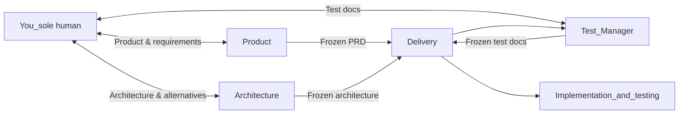
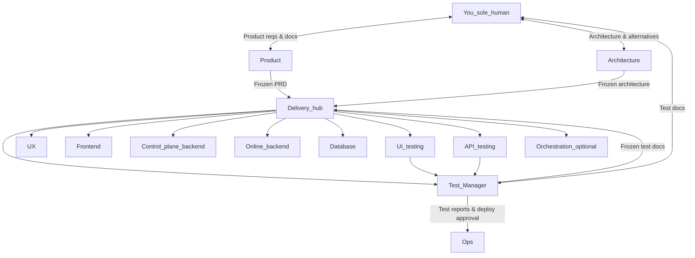
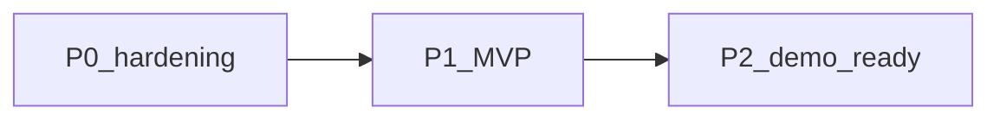
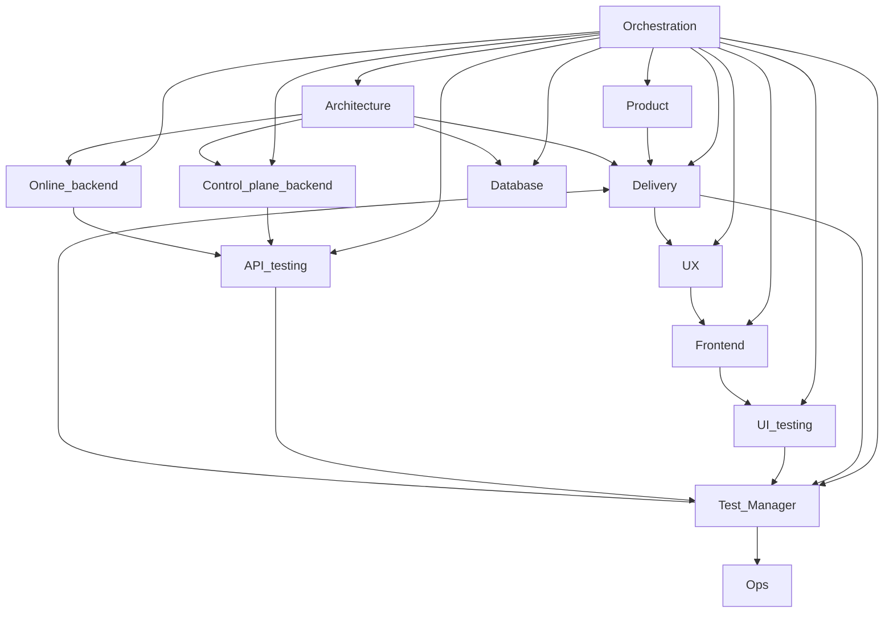

# Automation role system

> **English version.** For Chinese, see [`agent-system.zh.md`](agent-system.zh.md). Diagrams are **Mermaid** source blocks only (no separate image assets).

## Intro and scope

**This document is a generic template** (not bound to a specific repo path, stack, or domain). When applying it to a project, **write a separate project supplement** (e.g. `docs/agent-project-<name>.md`) mapping this template to that repo’s layout, APIs, CI, environments, etc.; **this file is not updated for project-specific details**.

This describes **automated roles** in collaboration: **you are the only human**. **Test-driven:** **approved, frozen test docs** (by you) → then implementation; the implementation side should follow **TDD** where practical. You work with **Product** (product docs), **Architecture** (architecture docs, two-way), and **Test Manager** (test docs + test reporting and deploy decisions); **Delivery** orchestrates execution after **PRD + architecture + test docs** are in place, and **does not** co-create architecture with you instead of **Architecture**. **You do not** own acceptance of Delivery’s process outputs (spot-check optional). Topology and details follow.

## Read me first

### Naming (no “Agent” in body)

Use the **role names** below consistently; do **not** write “So-and-so Agent.” For English communication or rule filenames/constants, see **Appendix · [Bilingual glossary](#bilingual)**; for code-style identifiers only, see **Appendix · English codes**.

### Categories and one-liners

| *Category* | *Focus* | *Roles* |
|:---|:---|:---|
| Management | Scope, decisions, docs & gates, orchestration | **Product**, **Delivery**, **Architecture** |
| Development | Design, front/back implementation, data & migrations | **UI design**, **Frontend**, **Control-plane backend**, **Online backend**, **Database** |
| Testing | Test docs, execution, report to Test Manager | **Test Manager**, **UI testing**, **API testing** |
| Operations | Deploy, pipelines, environments; optional split from Delivery | **Ops**, **Orchestration** (optional) |

UX/interaction may be owned by a dedicated person or **Frontend**; this template does not list it as its own row.

| *Role* | *One line* |
|:---|:---|
| Product | Writes PRD / requirements & acceptance; **does not** write code. |
| Delivery | Orchestrates roles and scheduling; **does not** co-create architecture with **Architecture** for you. |
| Architecture | Produces architecture docs and boundaries; **two-way** with you. |
| Test Manager | Versioned test docs; **UI/API test** reports; **Ops** only after **approval**. |
| Ops | CI/CD and deploy; **only** after **Test Manager** approval. |
| UI design | UI specs/designs; **does not** change app repo directly (unless agreed). |
| Frontend | Implements UI and integration. |
| Control-plane backend | Admin/control plane (vs online backend; per architecture). |
| Online backend | Online/request path backend. |
| Database | Migrations, schema, data policy. |
| UI testing | UI tests; reports to **Test Manager**. |
| API testing | API contract tests; reports to **Test Manager**. |
| Orchestration (optional) | Split from **Delivery**; **defaults** inside **Delivery**. |

**Do not** use vague “PM” for a person; say **Product** or **Delivery**.

The **role registry** below is a quick reference for inputs/outputs/forbids (still **draft**-level; tighten per project). **Role cards** follow Management / Development / Testing / Operations, matching the table above.

## Role registry (quick reference)

The table is wide; scroll horizontally on small screens, or use a wide view / PDF. Same convention as **Categories / one-liners**: one **bilingual** table (Chinese line, then English).

| *Role* | *Category* | *Key inputs* | *Key outputs* | *Forbidden (examples)* |
|:---|:---|:---|:---|:---|
| **Product** | Mgmt | Your priorities & scope | Versioned PRD, stories, acceptance | No implementation; no replacing **Architecture**; no directing **executors** other than via **Delivery** |
| **Delivery** | Mgmt | Frozen PRD + arch + test docs; CI/repo | Board, execution DoD, release handoff | No architecture co-design with you & **Architecture**; no dev dispatch before test docs approved; no secrets in plaintext |
| **Architecture** | Mgmt | Preferences/red lines; frozen PRD; README/OpenAPI | Versioned arch doc; optional alternatives | No direct prod config; not sole execution basis until frozen |
| **Test Manager** | Testing | Frozen PRD + arch; scope; UI/API reports | Versioned test docs; **pre-deploy sign-off** | No pushing dev before you approve; no app code; no **Ops** deploy without reports/sign-off |
| **UI design** | Dev | PRD excerpt + UI acceptance from **Delivery** + frozen test docs | Design exports | No direct app code (unless agreed path) |
| **Frontend** | Dev | Designs, PRD, frozen test docs, API contract | Front-end/static changes | No fake backend contracts |
| **Control-plane backend** | Dev | Arch, frozen test docs, OpenAPI | Control-plane APIs & tests | No bypassing errors/contracts |
| **Online backend** | Dev | Arch, frozen test docs, split vs control plane | Online path & observability | No blocking control-plane calls on hot path |
| **Database** | Dev | Arch & migration needs | Migration review | No destructive changes without backup policy |
| **UI testing** | Testing | Frozen test docs, PRD, build, scope from **Delivery** | UI test report & automation | No app edits; reports to **Test Manager**; no direct **Ops** |
| **API testing** | Testing | Frozen test docs, OpenAPI, errors, URLs | API report & automation | No undocumented private behavior; no replacing Test Manager’s master doc; **report to Test Manager**; no direct **Ops** |
| **Ops** | Ops | Deploy view, artifacts; **Test Manager** approval | Deploy & release summary | **No deploy without Test Manager**; no secrets in repo |
| **Orchestration** (optional) | Ops | Frozen triple + dispatch state | Internal checklists | No direct line to you; no owning secrets |

**Note:** Prompt paths and default output dirs can be filled per project under `docs/` or `.cursor/rules/`.

## Collaboration principles and gates

### TDD and test-document gates

| *Layer* | *Meaning* |
|:---|:---|
| Process | **PRD + architecture** frozen → **Test Manager** writes **versioned test docs** → **you** approve → **Delivery** may assign **implementation** (UX, front/back, DB, …). |
| Implementation | **Developers** follow **TDD**: **automated tests** first (unit/integration/contract per repo), then implement until green. |
| UI vs API testing | **Test Manager** defines *what* and *how* acceptance maps to executable items; **UI/API testing** **runs** after a build exists, adds automation & reports, aligned to frozen test docs. |
| Deploy chain | **UI/API tests** → **Test Manager** (report) → **approve** → **Ops** (any env). **Forbidden:** UI/API tests or **Architecture** triggers **Ops** directly. |

The **full orchestration diagram** shows the same **deploy chain** as this table, with more roles as nodes.

---

## Single-human mode: your role

**Your profile:** **You** are the **only human**; you want **product direction** and **technical architecture** to match your judgment—including preferred stacks and openness to **Architecture**’s alternatives. Goal: a **shippable** product you can demo; cadence is yours.

### Your three professional interfaces

| *Interface* | *What you do* | *Who owns it* |
|:---|:---|:---|
| Product | **In:** goals, constraints, priorities. **Accept:** **product docs** (PRD, stories, acceptance). | **Product**; CC **Delivery** when frozen |
| Architecture | **In:** red lines, preferred patterns, NFRs, where to experiment. **Review** main + **alt**; **accept** **architecture doc**. | **Architecture**; CC **Delivery**. **Delivery does not speak architecture for you.** |
| Test Manager | **In:** frozen **PRD** + **architecture** (via **Delivery**). **Accept:** **test doc** (plan, matrix, traceability). **Then** implementation may start. | **Test Manager**; then **Delivery** as contract for build & test execution |

### Delivery (hub: test after Product + Architecture freeze)

- **Inputs & gates:** **Delivery** starts from **two frozen baselines:** **Product** PRD (you approved) and **Architecture** doc. Then **Test Manager** produces **test docs**; the **third gate** is **your** approval of test docs. Only when **all three** are approved does **Delivery** assign dev work (UX, front, back, DB) and coordinate **UI/API test execution, Ops, orchestration**.
- **Boundaries:** **Delivery** does **not** “produce architecture”—that is **you ↔ Architecture**; it does **not** accept test docs **for** you (**Test Manager** interfaces with you).
- **Change & orders:** **You** do not micromanage **implementers**; product changes go through **Product**, architecture through **Architecture**; after refreeze, **Delivery** updates the plan; **test docs** must be **revised or bumped** and **you** re-approve before implementation continues.
- **Process outputs:** **You do not** formally accept Delivery’s operational artifacts (boards, daily DoD); spot-check if needed.
- **Deploy & secrets:** **External commitments** and **production secret handling** remain **yours**; **deploys** run via **Ops**, **only** after **CI/agreed tests** and **Test Manager** **approval** (from **UI/API test** reports) for **any** environment; **you** stay **informed** via **test conclusions and release summary**, no manual button every release.

### Relationship sketch (three lines + Delivery hub)

Only **you**, **Product**, **Architecture**, **Test Manager**, **Delivery**, and **implementation & testing**—for a quick view of who talks to you and what flows into Delivery. For **all roles**, see the next section.

## Orchestration and data flow (full diagram)

The **sketch** is expanded with **UX, front, both backends, DB, UI/API tests, Ops, orchestration**, plus test reporting and deploy approval edges—same **deploy chain** as under **Principles**.

**Principles:** **You** interface with **Product**, **Architecture**, **Test Manager** (test-doc gate + **execution reports & deploy approval**). **Delivery** chains **test docs** after **PRD + architecture** freeze; **after you approve test docs**, it coordinates implementation and testing—**not** replacing your dialogue with **Architecture**. **UI/API tests** report to **Test Manager**; **Ops** deploys **per environment** only after **Test Manager** approval; no secrets in plaintext—**you** configure CI secrets or equivalent.

## Product maturity: P0 / P1 / P2

Generic milestones from prototype to demo (**orthogonal** to the “three lines”: same interfaces, increasing maturity).

| *Stage* | *Goal* | *Typical outputs* | *Your focus* |
|:---|:---|:---|:---|
| P0 Hardening | Repo demo-stable: admin API + UI, docs & env reproducible | README/env notes, minimal auto tests, UI/API alignment | End-to-end wiring, conventions |
| P1 MVP | Clear Operation vs Online split; one main path E2E each | Arch one-pager, stable APIs/errors, basic observability | Architecture + key code |
| P2 Demo-ready | Narrative: security/backup/release; repeatable demo script | Release checklist, test report, product one-pager | Cadence + quality gates |

## Fully automated chain (reference)

When **no human** is in the loop, orchestration and dependencies look like this—contrast with **single-human** mode. **Deploy authorization** is **only Test Manager → Ops** (architecture’s **deploy view** enters via artifacts/config in the pipeline, **not** as a direct authorize edge). **Single-human** mode follows **three lines + test gate + Delivery hub**.

---

## Role cards (by category)

Each card can become a **Cursor Rule / Skill / system prompt** skeleton. **Default:** **you** talk to **Product / Architecture / Test Manager**; **Delivery** assigns implementation and testing; **Ops** only after **Test Manager** deploy approval; **Delivery** does not co-architect with **Architecture** for you.

### Management

#### Product

| *Dimension* | *Description* |
|:---|:---|
| **Purpose** | **Product:** intake **your** needs, deliver **product docs** for your acceptance; **does not** run the implementation chain; **does not** replace **Architecture**. |
| **Inputs** | **From you only:** notes, goals, scope changes. |
| **Outputs** | PRD, stories, acceptance, change log; **frozen versions** to **Delivery** as contract input. |
| **Tools** | Doc repo (Markdown); optional issue templates. |
| **Constraints** | No implementation; no scope creep without **you**; **no** Delivery’s scheduling role; **no** signing off architecture docs. |
| **Handoff** | Approved product docs → **Delivery**; **Architecture** is **you** direct, **not** via Delivery assignment. |

#### Delivery

| *Dimension* | *Description* |
|:---|:---|
| **Purpose** | **Execution / program:** After **PRD + architecture** freeze, coordinate **Test Manager** for test docs; after **you** approve test docs, **orchestrate** UX, front, back, DB, test execution, Ops, delivery orchestration (may embed **Orchestration**). **You do not** accept Delivery’s process outputs (unless you spot-check). |
| **Inputs** | **Two frozen baselines** + **frozen test docs:** **Product** PRD; **Architecture** doc; **Test Manager** test docs (all approved by you); repo & CI; feedback from **executors**. |
| **Outputs** | Board, milestones, execution DoD checks, release handoff; conflicts escalate to **Product**, **Architecture**, or **Test Manager**—**no** replacing your product/arch decisions. |
| **Tools** | Issues/milestones, Markdown boards; CI hooks. |
| **Constraints** | No implementation code; **before test-doc approval**, do not assign **implementers** (UX, front, control/online back, DB); **no** accepting test docs **for** you; **no** replacing **you ↔ Architecture** co-design. |
| **Handoff** | Coordinate **Test Manager**; after test-doc approval, dispatch implementation and testing; **no** “creative briefs” to **Architecture** (**Architecture** is **you** direct). |

#### Architecture

| *Dimension* | *Description* |
|:---|:---|
| **Purpose** | Define Operation vs Online boundaries, interfaces, data flows; **main design** under **your** preferences/red lines; **optional exploratory alternatives** (components, modes, risk, rollback); **architecture doc** accepted by **you**, then **Delivery** executes. |
| **Inputs** | **From you:** stack prefs, patterns, bans, exploration scope; **approved product docs** (from **Product**, CC **Architecture**); README/OpenAPI, NFRs. |
| **Outputs** | Arch doc (context/component/sequence), API contracts, DB migration principles; optional **plan B/C** appendix. |
| **Tools** | Mermaid/PlantUML, OpenAPI, `README.md` alignment. |
| **Constraints** | No direct prod config; DB rollout coordinated by **Delivery** after **architecture** freeze; not baseline until **you** accept. |
| **Handoff** | Arch doc → **you**; then **Delivery** syncs **Test Manager** (test docs) and **control/online/database** roles. **Delivery does not** replace **you ↔ Architecture** dialogue. |

### Development

#### UI design

| *Dimension* | *Description* |
|:---|:---|
| **Purpose** | Deliverable UI specs before coding; less UI rework. |
| **Inputs** | **Only after** **you** approve test docs: PRD excerpt from **Delivery**, UI acceptance from **frozen test docs**, brand/components, Web/mobile. |
| **Outputs** | Design links/exports, page list, component states, interaction notes (Markdown). |
| **Tools** | Team design tools (Figma, etc.), exports. |
| **Constraints** | No direct repo edits; flag complex UX for **Architecture/Frontend**; mappable to routes/components. |
| **Handoff** | Report to **Delivery**; align with UI dev / Arch via **Delivery**. |

#### Frontend

| *Dimension* | *Description* |
|:---|:---|
| **Purpose** | Implement designs & PRD as integrable front-end; **TDD:** tests for **testable behavior** first (unit/E2E per convention). |
| **Inputs** | UI outputs, PRD, **frozen test docs**, OpenAPI or base URL contract. |
| **Outputs** | Static assets or FE changes, integration notes, env examples. |
| **Tools** | FE tree or standalone app, browser, HTTP client (per architecture). |
| **Constraints** | No fake backend contracts; errors/empty states match **frozen PRD** and **test docs**; no large files/secrets in repo. |
| **Handoff** | Testable build notes → **UI testing** (via **Delivery**). |

#### Control-plane backend

| *Dimension* | *Description* |
|:---|:---|
| **Purpose** | Implement **Operation / control-plane** backend per PRD/architecture. |
| **Inputs** | Arch doc, **frozen test docs** (**Test Manager**), domain model, API contract, DB migration rules if any. |
| **Outputs** | Module changes, automated tests, behavior notes. |
| **Tools** | Build/test stack, layering per architecture. |
| **Constraints** | Unified errors/semantics; contract changes notify **API testing**; **TDD** vs **frozen test docs**. |

#### Online backend

| *Dimension* | *Description* |
|:---|:---|
| **Purpose** | Implement **Online / request path** per architecture. |
| **Inputs** | Arch doc, **frozen test docs**, split vs control plane & config reads, SLO if any. |
| **Outputs** | Online path code, runtime notes, logging/metrics suggestions. |
| **Tools** | Same stack & pipeline; load tests optional. |
| **Constraints** | Decoupled from control plane; no blocking control calls on hot path; **TDD** for changes. |

#### Database

| *Dimension* | *Description* |
|:---|:---|
| **Purpose** | Evolvable schema, rollback, clear permissions & backup policy. |
| **Inputs** | Data model from architecture, migration needs, audit/history fields if needed. |
| **Outputs** | Migration conventions, review notes, env init checklist, index/slow-query notes. |
| **Tools** | Flyway/Liquibase or project standard, DB docs. |
| **Constraints** | No destructive changes without backup policy; prod windows approved by **you** (**Delivery** may draft checklist). |

### Testing

#### Test Manager

| *Dimension* | *Description* |
|:---|:---|
| **Purpose** | With frozen **PRD** + **architecture**, ship **versioned test docs** as **dev-start gate**; align with **you** on scope & acceptance; **receive** **UI/API test** reports; **approve/deny** **deploys**; **do not** replace **Product** or **hands-on test automation** (see principles). |
| **Inputs** | Frozen PRD & architecture, scope/version (**Delivery**); optional OpenAPI/glossary; **UI/API test** reports before deploy. |
| **Outputs** | **Test plan**, **case matrix**, **traceability** to PRD, **env/data prerequisites**; version bumps; **pre-deploy verdict** for **Ops**. |
| **Tools** | Markdown/tables; optional TestRail-like tools; issue templates. |
| **Constraints** | Before **you** approve test docs, do not greenlight dev; no app code; cases **scriptable** by UI/API tests (or marked manual); **no Ops** without reports/sign-off. |
| **Handoff** | Test docs → **you** → **Delivery** assigns dev; **UI/API tests** report to **Test Manager**; **approval** → **Ops** (all envs). |

#### UI testing

| *Dimension* | *Description* |
|:---|:---|
| **Purpose** | **Execute** UI-side verification and **test reports**; align to **Test Manager**’s **frozen test docs**; add **automation** (Playwright/Cypress, etc.). |
| **Inputs** | **Frozen test docs** (**Test Manager**), PRD, designs, runnable UI build; scope by **Delivery**. |
| **Outputs** | Run logs, defects, reports; optional scripts. |
| **Tools** | Exploratory + optional Playwright/Cypress (aligned to pipeline). |
| **Constraints** | API issues → **API testing**; no app code changes; **master plan** is **Test Manager**’s; **no** direct **Ops** deploy. |
| **Handoff** | → **Test Manager**; deploy after **Test Manager** approval, **Ops** executes (see **Test Manager**, **Ops** cards). |

#### API testing

| *Dimension* | *Description* |
|:---|:---|
| **Purpose** | **Execute** contract/API verification; **automation evidence** + **reports**; align to **frozen test docs**. |
| **Inputs** | **Frozen test docs** (**Test Manager**), OpenAPI or equivalent, error catalog, test base URL. |
| **Outputs** | Cases & data, API automation, reports, CI artifacts. |
| **Tools** | HTTP clients, contract/collection tools, project test framework, CI attachments. |
| **Constraints** | No reliance on undocumented behavior; split with **UI testing**: contract vs presentation; scope owned by **Test Manager**; **no** direct **Ops**. |
| **Handoff** | Same as **UI testing** (→ **Test Manager** → **Ops**). |

### Operations

#### Ops

| *Dimension* | *Description* |
|:---|:---|
| **Purpose** | **Deploy & ops automation** (CI/CD, artifacts to envs, rollback, health checks); **only** after **CI/agreed tests** and **Test Manager** **approval** (from **UI/API** reports); **release summary** to **you** (version, env, time, health). |
| **Inputs** | Deploy view from **frozen architecture**, artifact versions, CI outputs, env matrix; **Test Manager** **approval** tied to test conclusions. |
| **Outputs** | Pipeline-as-code, deploy notes, rollback, log summary. |
| **Tools** | CI, containers, orchestration, SSH per architecture; secrets via CI/secret stores—**not** plaintext in repo. |
| **Constraints** | **No deploy** without **Test Manager** approval on reports; **no** skipping gates; **no** secrets in repo; rollback path per architecture & ops agreement. |

#### Orchestration (optional)

| *Dimension* | *Description* |
|:---|:---|
| **Purpose** | **Optional:** split **delivery orchestration** when **Delivery** is overloaded. **Default:** stay inside **Delivery**. **No** direct line to **you**; your interfaces remain **Product + Architecture + Test Manager**. |
| **Inputs** | Approved product/arch/test docs (in **Delivery**), dispatch state, repo & CI status. |
| **Outputs** | Internal boards & checklists for **Delivery** to consolidate. |
| **Tools** | Issues/milestones or Markdown boards; optional CI linkage. |
| **Constraints** | **No** replacing **you** on secrets or commitments; **no** prod secrets; **not** a second “you-facing” entry. |

---

## Execution tips (adopted)

**DoD (you accept):** PRD + architecture + test docs. Execution DoD via **Delivery**; **testing:** **Test Manager** owns docs; **UI/API testing** executes and automates—same as role cards.

Operational rules below; aligned with **three lines + Delivery hub**.

1. **Versioning:** **Product** / **Architecture** / **Test Manager** tag PRD, arch doc, test doc with **version + date**; **Delivery** schedules only against **matched triples**—avoid “aligned in chat, not in docs.”
2. **Exploration items:** **Architecture** alternatives (B/C) each need **risk**, **rollback**, **release impact**; you decide scope.
3. **PRD vs arch order:** Usually **PRD direction first, then architecture**; tech-debt-only may be **architecture-only** (PRD = NFR/constraints). Flexible per iteration.
4. **Test-doc gate:** After **PRD + architecture** freeze, **Test Manager** writes test docs; **you** approve before **development**; on scope change, **bump test docs** and re-approve.
5. **TDD:** **Implementers** prefer **failing tests or contracts first**, aligned to **frozen test docs**; **CI** runs automation; **deploy** path: **UI/API tests → Test Manager → approval → Ops** (**all** environments).
6. **Escalation:** Execution trusts **frozen PRD + architecture + test docs** only; new needs → **update Product / Architecture / Test Manager docs** first, then **Delivery**—no mid-flight verbal scope.
7. **Cadence:** Each iteration, at least one **Product** sync, one **Architecture** sync, one **test-doc review**—reduce async thrash.

---

## Appendix

### Bilingual glossary (roles & terms)

Chinese names are **canonical** in body text. Use the tables for English communication, English prompts, or bilingual docs; **codes** pair with suggested English in the same column.

#### Roles

| *Name* | *Suggested English · code* |
|:---|:---|
| Product | Product · `PM_Product` |
| Delivery | Delivery / Project orchestration · `PM_Project` |
| Architecture | Architecture · `Architect` |
| Test Manager | Test Manager / QA Lead · `Test_Manager` |
| UI design | UI Design · `UI_Design` |
| Frontend | Frontend · `Frontend` |
| Control-plane backend | Backend (control / management plane) · `Backend_Operation` |
| Online backend | Backend (online / data plane) · `Backend_Online` |
| Database | Database · `Database` |
| UI testing | UI Testing · `UI_Test` |
| API testing | API Testing · `API_Test` |
| Ops | Operations / DevOps · `Ops` |
| Orchestration (optional) | Orchestration · `Orchestrator` |

#### Categories

| *Category* |
|:---|
| Management / governance |
| Development |
| Testing / QA |
| Operations & maintenance |

#### Common terms

| *Term* |
|:---|
| Sole human stakeholder |
| Approved baseline / frozen |
| Product Requirements Document |
| Architecture document |
| Test plan & cases (versioned) |
| Gate |
| Implementation roles |
| Executor roles |
| Delivery hub |
| Test-Driven Development |
| Continuous Integration / Continuous Delivery |
| Deployment approval |
| Release summary |

---

### English codes (optional)

**Codes** match the backtick identifiers in **Roles** above (**English · code** column). Use only for **Cursor Rule / constants / script names**; **not** required in narrative text.

---

### P0–P2 vs repo (out of scope here)

**This template** only defines maturity goals and **roles** (see **Product maturity: P0 / P1 / P2**).  
**Per-repo** paths—layout, entrypoints, OpenAPI/Swagger, CI commands, config locations—belong in the **project supplement**, maintained by **Delivery** / **Architecture**; **do not** paste project paths back into this template.

---

### Relation to prior versions

This version binds duties to **role cards + registry**; **per-repo paths and class mappings** live in the **project supplement** (see **P0–P2 mapping**). **You** interface **Product / Architecture (two-way) / Test Manager**; **Delivery** orchestrates after **PRD + architecture + test docs** are approved. **Deploy chain:** UI/API tests → Test Manager → Ops (**only authorized edge**). With no human, **Orchestration** may be central; with a human, it may fold into **Delivery**. **Do not** use vague “PM” for people (see **Read me first · Naming**).
