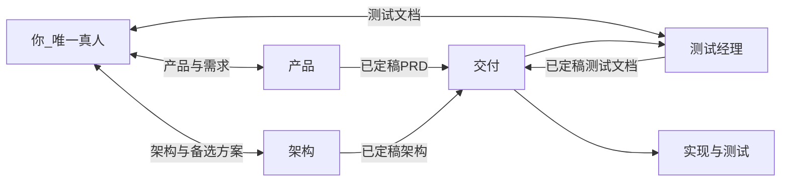
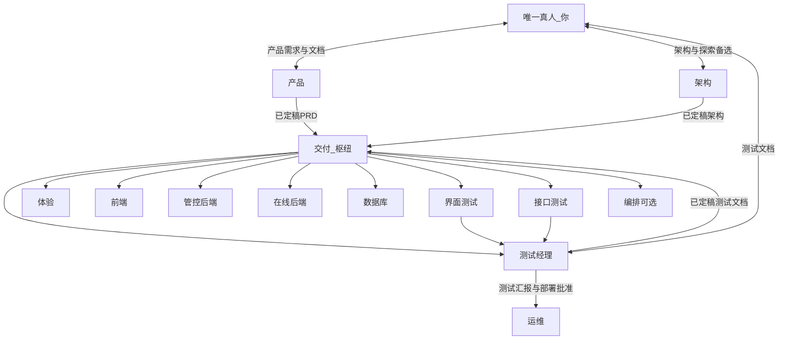
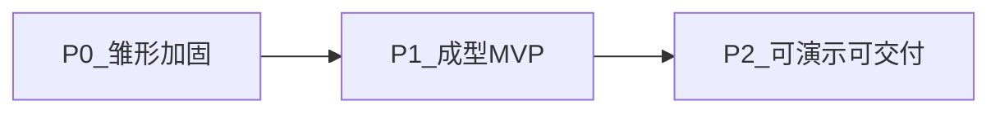
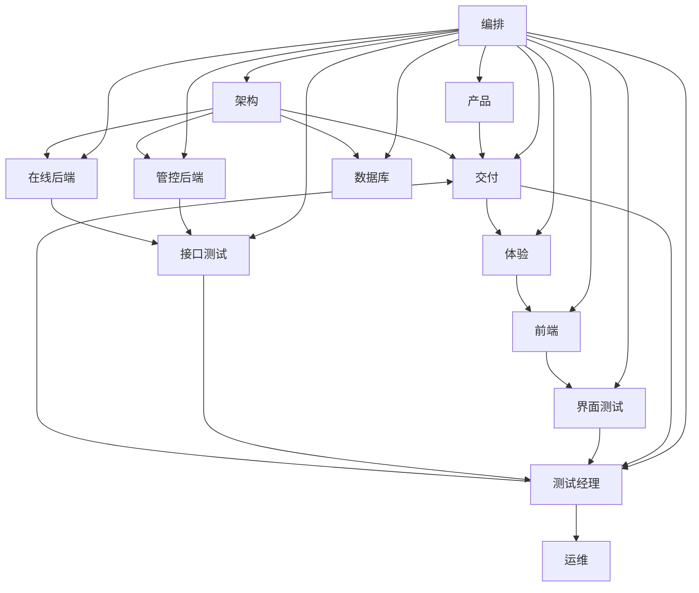

# 自动化角色体系 / Automation role system

> **体例**：正文以中文为主；**每段中文后附一段英文**（引用块）。**凡表格**（含角色注册表、里程碑、角色定义卡、附录对照表）均为 **中英对照单表**：表头双语，单元格内 **中文换行后英文**（或「称呼 + 英文建议 + 代号」合并列）。文中的 **流程图** 以 `docs/assets/diagrams/*.svg` 为准；图下 **Mermaid** 为可编辑源码（[Mermaid Live Editor](https://mermaid.live)）。

> **Convention:** Chinese is primary; **each Chinese paragraph is followed by an English paragraph** (blockquote). **All tables**—registry, maturity, role cards, appendix—use **one bilingual table** per section (bilingual headers; **Chinese then English** in cells, or a merged **name · English · code** column). **Figures:** SVGs under `docs/assets/diagrams/`; **Mermaid** below for editing ([Mermaid Live Editor](https://mermaid.live)).

> **通用模板**：不与具体仓库路径、技术栈或单项目细节绑定；落地时另写项目级补充文档。
>
> **快速导航：** [导语](#intro) · [读前须知](#read-first) · [角色注册表](#registry) · [协作原则](#principles) · [唯一真人模式](#human-mode) · [编排完整图](#orchestration-full) · [产品成熟度](#maturity) · [纯自动化链](#autochain) · [角色定义卡](#role-cards) · [落地建议](#execution) · [附录](#appendix) · [中英文对照](#bilingual)

> **Generic template:** not tied to a specific repo path, stack, or project terms; for a real project, add a separate project supplement.
>
> **Quick nav:** [Intro](#intro) · [Read me first](#read-first) · [Role registry](#registry) · [Principles](#principles) · [Single-human mode](#human-mode) · [Full orchestration diagram](#orchestration-full) · [Maturity](#maturity) · [Fully automated chain](#autochain) · [Role cards](#role-cards) · [Execution tips](#execution) · [Appendix](#appendix) · [CN–EN glossary](#bilingual)

## 导语与模板边界 / Intro and scope

**本文档为通用模板**（不绑定具体仓库路径、技术栈或领域名词）。落地到某一项目时，请**另写**一份 **项目级补充文档**（例如 `docs/agent-project-<项目名>.md`），结合本模板与**该仓库**的目录、API、CI、环境等做映射；**本文件不随单项目细节改版**。

> **This document is a generic template** (not bound to a specific repo path, stack, or domain). When applying it to a project, **write a separate project supplement** (e.g. `docs/agent-project-<name>.md`) mapping this template to that repo’s layout, APIs, CI, environments, etc.; **this file is not updated for project-specific details**.

本文档描述可落地的 **自动化角色** 协作方式：**唯一真人是你**。**测试驱动**：**已定稿测试文档**（你批准）→ 再开发；实现侧尽量 **TDD**。你对接 **产品**（产品文档）、**架构**（架构文档，双向）、**测试经理**（测试文档 + 测试汇报与部署裁决）；**交付** 在 **PRD + 架构 + 测试文档** 齐备后串联执行，**不**代你与 **架构** 共创。**你不对交付** 的过程性产出负责（可抽查）。拓扑与细则见下文。

> This describes **automated roles** in collaboration: **you are the only human**. **Test-driven:** **approved, frozen test docs** (by you) → then implementation; the implementation side should follow **TDD** where practical. You work with **Product** (product docs), **Architecture** (architecture docs, two-way), and **Test Manager** (test docs + test reporting and deploy decisions); **Delivery** orchestrates execution after **PRD + architecture + test docs** are in place, and **does not** co-create architecture with you instead of **Architecture**. **You do not** own acceptance of Delivery’s process outputs (spot-check optional). Topology and details follow.

## 读前须知 / Read me first

### 称呼说明（正文不带「Agent」）/ Naming (no “Agent” in body)

正文统一用下表**角色称呼**，**不**再写「某某 Agent」。需要与英文沟通或写规则文件名、代码常量时，见 **附录 · [中英文对照](#bilingual)**；仅查常量缩写见 **附录 · 英文代号**。

> Use the **role names** below consistently; do **not** write “So-and-so Agent.” For English communication or rule filenames/constants, see **Appendix · [Bilingual glossary](#bilingual)**; for code-style identifiers only, see **Appendix · English codes**.

### 角色分类与一句话速览 / Categories and one-liners

**角色分类 · Categories**

| **类别** *Category* | **侧重** *Focus* | **包含角色** *Roles* |
|:---|:---|:---|
| **管理** Management | 范围与决策、文档与门禁、执行串联 Scope, decisions, docs & gates, orchestration | **产品**、**交付**、**架构** **Product**, **Delivery**, **Architecture** |
| **开发** Development | 设计稿与前后端实现、数据与迁移 Design, front/back implementation, data & migrations | **界面设计**、**前端**、**管控后端**、**在线后端**、**数据库** **UI design**, **Frontend**, **Control-plane backend**, **Online backend**, **Database** |
| **测试** Testing | 测试文档、用例执行、向测试经理汇报 Test docs, execution, report to Test Manager | **测试经理**、**界面测试**、**接口测试** **Test Manager**, **UI testing**, **API testing** |
| **维护** Operations | 部署、流水线、环境；可选从交付拆出 Deploy, pipelines, environments; optional split from Delivery | **运维**、**编排**（可选） **Ops**, **Orchestration** (optional) |

体验/交互可在团队中由专人或 **前端** 兼管，本模板不单独占一行角色。

> UX/interaction may be owned by a dedicated person or **Frontend**; this template does not list it as its own row.

**一句话速览 · One-liners**

| **通俗称呼** *Role* | **做什么（一句话）** *One line* |
|:---|:---|
| **产品** · Product | 写 PRD / 需求与验收口径，**不**写代码。 Writes PRD / requirements & acceptance; **does not** write code. |
| **交付** · Delivery | 串联各角色、排期分派；**不**替你与 **架构** 共创架构。 Orchestrates roles and scheduling; **does not** co-create architecture with **Architecture** for you. |
| **架构** · Architecture | 出架构文档与技术边界；与你 **双向** 对齐。 Produces architecture docs and boundaries; **two-way** with you. |
| **测试经理** · Test Manager | 写版本化测试文档、收汇报、**批准** 后 **运维** 才能部署。 Versioned test docs; **UI/API test** reports; **Ops** only after **approval**. |
| **运维** · Ops | CI/CD 与部署执行；**仅**在 **测试经理** 批准之后动环境。 CI/CD and deploy; **only** after **Test Manager** approval. |
| **界面设计** · UI design | 出界面规格/设计稿，**不**直接改业务仓库（除非约定路径）。 UI specs/designs; **does not** change app repo directly (unless agreed). |
| **前端** · Frontend | 实现界面与联调。 Implements UI and integration. |
| **管控后端** · Control-plane backend | 管理/控制面后端（与「在线后端」相对，具体含义以架构为准）。 Admin/control plane (vs online backend; per architecture). |
| **在线后端** · Online backend | 在线/执行路径上的后端。 Online/request path backend. |
| **数据库** · Database | 迁移、schema、数据策略。 Migrations, schema, data policy. |
| **界面测试** · UI testing | 跑 UI 侧测试并汇报 **测试经理**。 UI tests; reports to **Test Manager**. |
| **接口测试** · API testing | 跑 API 契约测试并汇报 **测试经理**。 API contract tests; reports to **Test Manager**. |
| **编排**（可选）· Orchestration | 从 **交付** 拆出的子能力，**默认**并入 **交付**。 Split from **Delivery**; **defaults** inside **Delivery**. |

**禁用**：用含糊的「PM」指代人；须说 **产品** 或 **交付**。

> **Do not** use vague “PM” for a person; say **Product** or **Delivery**.

下文 **角色注册表** 为输入/输出/禁止项速查（表内约定仍为**草稿**级，可按项目收紧）；**角色定义卡** 按管理 / 开发 / 测试 / 维护 展开，与上表类别一致。

> The **role registry** below is a quick reference for inputs/outputs/forbids (still **draft**-level; tighten per project). **Role cards** follow Management / Development / Testing / Operations, matching the table above.

## 角色注册表（速查）/ Role registry (quick reference)

下表列较多，窄屏阅读时可横向滚动，或宽屏 / 导出 PDF 查阅更清晰。与上文 **角色分类 / 一句话** 相同，采用 **中英对照单表**（单元格内先中文、换行后英文）。

> The table is wide; scroll horizontally on small screens, or use a wide view / PDF. Same convention as **Categories / one-liners**: one **bilingual** table (Chinese line, then English).

| **称呼** *Role* | **类别** *Category* | **核心输入** *Key inputs* | **核心输出** *Key outputs* | **禁止项（示例）** *Forbidden (examples)* |
|:---|:---|:---|:---|:---|
| **产品** **Product** | 管理 Mgmt | 你的需求要点、优先级、范围 Your priorities & scope | 版本化 PRD、用户故事、验收标准 Versioned PRD, stories, acceptance | 不写实现代码；不替代 **架构**；不指挥 **交付** 以外的 **执行角色** No implementation; no replacing **Architecture**; no directing **executors** other than via **Delivery** |
| **交付** **Delivery** | 管理 Mgmt | **已定稿** PRD + 架构 + 测试文档；CI/仓库状态 Frozen PRD + arch + test docs; CI/repo | 任务看板、执行侧 DoD、发布摘要对接 Board, execution DoD, release handoff | 不参与你与 **架构** 的架构共创；测试文档未批准不向实现类分派开发；密钥明文不入库 No architecture co-design with you & **Architecture**; no dev dispatch before test docs approved; no secrets in plaintext |
| **架构** **Architecture** | 管理 Mgmt | 技术偏好/红线；已定稿 PRD（抄送）；仓库 README/OpenAPI Preferences/red lines; frozen PRD; README/OpenAPI | 版本化架构文档；可选主方案 + 探索备选附录 Versioned arch doc; optional alternatives | 不直接改生产配置；未定稿前不作为执行唯一依据 No direct prod config; not sole execution basis until frozen |
| **测试经理** **Test Manager** | 测试 Testing | 已定稿 PRD + 架构；迭代范围；界面/接口测试汇报 Frozen PRD + arch; scope; UI/API reports | 版本化测试文档；**部署前放行** Versioned test docs; **pre-deploy sign-off** | 你批准前不推动开发启动；不写业务实现代码；无有效汇报与放行不指示 **运维** 部署 No pushing dev before you approve; no app code; no **Ops** deploy without reports/sign-off |
| **界面设计** **UI design** | 开发 Dev | **交付** 下发的 PRD 摘要 + **已定稿测试文档** 中的 UI 验收点 PRD excerpt + UI acceptance from **Delivery** + frozen test docs | 设计说明/设计稿导出 Design exports | 不直接改业务仓库代码（除非约定为设计导出路径） No direct app code (unless agreed path) |
| **前端** **Frontend** | 开发 Dev | 设计稿 + PRD + **已定稿测试文档** + API 约定 Designs, PRD, frozen test docs, API contract | 前端/静态资源变更 Front-end/static changes | 不伪造后端契约 No fake backend contracts |
| **管控后端** **Control-plane backend** | 开发 Dev | 架构文档、**已定稿测试文档**、领域与 OpenAPI Arch, frozen test docs, OpenAPI | 管控面 API 与测试 Control-plane APIs & tests | 不绕过统一错误码与契约 No bypassing errors/contracts |
| **在线后端** **Online backend** | 开发 Dev | 架构文档、**已定稿测试文档**、与管控面约定 Arch, frozen test docs, split vs control plane | 在线请求链与观测建议 Online path & observability | 热路径不阻塞式依赖管控面 No blocking control-plane calls on hot path |
| **数据库** **Database** | 开发 Dev | 架构与迁移需求 Arch & migration needs | 迁移规范与评审意见 Migration review | 无备份环境不执行破坏性变更 No destructive changes without backup policy |
| **界面测试** **UI testing** | 测试 Testing | **已定稿测试文档**、PRD、构建、**交付** 协调的范围 Frozen test docs, PRD, build, scope from **Delivery** | 界面测试报告与可选自动化 UI test report & automation | 不改业务代码；不替代测试经理主文档；**向测试经理汇报**；不直接触发 **运维** No app edits; reports to **Test Manager**; no direct **Ops** |
| **接口测试** **API testing** | 测试 Testing | **已定稿测试文档**、OpenAPI、错误码表、环境 URL Frozen test docs, OpenAPI, errors, URLs | 接口测试报告与自动化证据 API report & automation | 不依赖未文档化私有行为；不替代测试经理主文档；**向测试经理汇报**；不直接触发 **运维** No undocumented private behavior; no replacing Test Manager’s master doc; **report to Test Manager**; no direct **Ops** |
| **运维** **Ops** | 维护 Ops | 架构部署视图、CI 产物；**测试经理** 部署批准 Deploy view, artifacts; **Test Manager** approval | 部署执行、发布摘要 Deploy & release summary | **无测试经理批准不部署任何环境**；不将密钥写入仓库 **No deploy without Test Manager**; no secrets in repo |
| **编排**（可选） **Orchestration** (optional) | 维护 Ops | 已进入 **交付** 的三路定稿、分派状态 Frozen triple + dispatch state | 内部看板与 checklist 草案 Internal checklists | 不对你输出；不替代密钥与对外承诺 No direct line to you; no owning secrets |

> **说明**：入口提示词路径、默认输出目录可在仓库 `docs/` 或 `.cursor/rules/` 中按项目再填。

> **Note:** Prompt paths and default output dirs can be filled per project under `docs/` or `.cursor/rules/`.

## 协作原则与门禁 / Collaboration principles and gates

### 测试驱动与测试文档门禁（总策略）/ TDD and test-document gates

**中英对照 · Bilingual**

| **层级** *Layer* | **含义** *Meaning* |
|:---|:---|
| **流程层** · Process | **PRD + 架构** 均已定稿 → **测试经理** 编写 **版本化测试文档** → **你** 批准 → **交付** 才可分派 **实现类** 任务（体验/交互、前端、后端、数据库等）。 **PRD + architecture** frozen → **Test Manager** writes **versioned test docs** → **you** approve → **Delivery** may assign **implementation** (UX, front/back, DB, …). |
| **实现层** · Implementation | **开发角色** 在迭代内尽量遵循 **TDD**：先 **自动化测试**（单元/集成/契约，以仓库约定为准），再实现至通过（Red → Green → Refactor）。 **Developers** follow **TDD**: **automated tests** first (unit/integration/contract per repo), then implement until green. |
| **与界面/接口测试的分工** · UI vs API testing | **测试经理** 定「测什么、验收如何写成可执行条目」；**界面测试 / 接口测试** 在 **有可运行构建后** 负责 **执行、自动化、报告**，对齐已定稿测试文档。 **Test Manager** defines *what* and *how* acceptance maps to executable items; **UI/API testing** **runs** after a build exists, adds automation & reports, aligned to frozen test docs. |
| **部署与测试汇报链** · Deploy chain | **界面测试 / 接口测试** → **测试经理** → **批准** → **运维**。**禁止** 界面/接口测试或 **架构** 直连触发 **运维** 部署。 **UI/API tests** → **Test Manager** (report) → **approve** → **Ops** (any env). **Forbidden:** UI/API tests or **Architecture** triggers **Ops** directly. |

下文「编排与数据流（完整图）」中的部署关系与本表 **部署与测试汇报链** 一致，仅补充角色节点。

> The **full orchestration diagram** shows the same **deploy chain** as this table, with more roles as nodes.

---

## 唯一真人模式：你的位置与分工 / Single-human mode: your role

**你的画像**：体系中 **唯一真人**；希望 **产品方向** 与 **技术架构** 都符合自己的判断——包括对熟悉栈的坚持，也愿意评估 **架构** 提出的新方案。目标将当前产品做成可对外展示的 **成型交付**，节奏由你自定。

> **Your profile:** **You** are the **only human**; you want **product direction** and **technical architecture** to match your judgment—including preferred stacks and openness to **Architecture**’s alternatives. Goal: a **shippable** product you can demo; cadence is yours.

### 你直接对接的专业线：产品经理 + 架构师 + 测试经理 / Your three professional interfaces

| **接口** *Interface* | **你做什么** *What you do* | **谁承接** *Who owns it* |
|:---|:---|:---|
| **↔ 产品** · Product | **输入**：需求要点、迭代目标、约束、优先级。**验收**：**产品文档**（PRD、用户故事、验收标准等），定稿后作为需求基线。 **In:** goals, constraints, priorities. **Accept:** **product docs** (PRD, stories, acceptance). | **产品**；定稿后抄送 **交付** **Product**; CC **Delivery** when frozen |
| **↔ 架构** · Architecture | **输入**：技术红线、**你熟悉并希望沿用的架构/模式**、非功能约束、可探索边界。**对话**：审阅主方案与 **备选/探索方案**，**验收** **架构文档**。 **In:** red lines, preferred patterns, NFRs, where to experiment. **Review** main + **alt**; **accept** **architecture doc**. | **架构**；定稿后抄送 **交付**。**交付 不替你与架构对话**。 **Architecture**; CC **Delivery**. **Delivery does not speak architecture for you.** |
| **↔ 测试经理** · Test Manager | **输入**：已定稿 **PRD** 与 **架构文档**（**交付** 协调范围与版本）。**验收**：**测试文档**（计划、矩阵、追溯）。**通过后**才允许 **实现开发**。 **In:** frozen **PRD** + **architecture** (via **Delivery**). **Accept:** **test doc** (plan, matrix, traceability). **Then** implementation may start. | **测试经理**；定稿后交 **交付** 作为契约。 **Test Manager**; then **Delivery** as contract for build & test execution |

### 交付（执行枢纽：「产品 + 架构」定稿后先测后写）/ Delivery (hub: test after Product + Architecture freeze)

- **输入与门禁**：**交付** 以 **两路已定稿** 为起点：**产品** 的 PRD（你已批准）、**架构** 的架构文档（你已批准）。随后协调 **测试经理** 产出 **测试文档**；**第三路门禁** 为 **你** 对测试文档的批准。**三路齐备且测试文档已批准** 后，才对 **体验/交互、前端、后端、数据库** 分派开发任务，并对 **界面/接口测试执行、运维、交付编排** 做分派与跟进。
- **与架构 / 测试的边界**：**不**要求 **交付**「组织架构出稿」——那是 **你 ↔ 架构** 的职责；**不**代替 **你** 验收测试文档（**测试经理** 对你接口）。
- **变更与指令**：**你**不逐一向 **实现类角色** 下指令；需求变更走 **产品**；架构变更走 **架构**；二者定稿后再由 **交付** 调整执行计划；**测试文档** 须随变更 **回写或升版** 并经 **你** 批准，再进入实现。
- **过程性交付物**：**你不对交付** 的过程性交付物（看板、日报、执行侧 DoD）负责验收；需要时可抽查。
- **部署与密钥**：**对外承诺** 与 **生产密钥的保管方式** 仍由 **你** 决策；**部署/发版** 由 **运维** 执行，但 **仅**在 **CI/约定测试通过** 且 **测试经理** 已 **批准**（基于 **界面测试 / 接口测试** 的测试汇报）后，才对 **任意目标环境** 触发；**你** 以 **测试结论与发布摘要** **知情** 即可，无需每版手动点发布。

> - **Inputs & gates:** **Delivery** starts from **two frozen baselines:** **Product** PRD (you approved) and **Architecture** doc. Then **Test Manager** produces **test docs**; the **third gate** is **your** approval of test docs. Only when **all three** are approved does **Delivery** assign dev work (UX, front, back, DB) and coordinate **UI/API test execution, Ops, orchestration**.
> - **Boundaries:** **Delivery** does **not** “produce architecture”—that is **you ↔ Architecture**; it does **not** accept test docs **for** you (**Test Manager** interfaces with you).
> - **Change & orders:** **You** do not micromanage **implementers**; product changes go through **Product**, architecture through **Architecture**; after refreeze, **Delivery** updates the plan; **test docs** must be **revised or bumped** and **you** re-approve before implementation continues.
> - **Process outputs:** **You do not** formally accept Delivery’s operational artifacts (boards, daily DoD); spot-check if needed.
> - **Deploy & secrets:** **External commitments** and **production secret handling** remain **yours**; **deploys** run via **Ops**, **only** after **CI/agreed tests** and **Test Manager** **approval** (from **UI/API test** reports) for **any** environment; **you** stay **informed** via **test conclusions and release summary**, no manual button every release.

### 关系简图（三线接口 + 交付枢纽）/ Relationship sketch (three lines + Delivery hub)

只保留 **你**、**产品**、**架构**、**测试经理**、**交付** 与汇总节点 **实现与测试**，用于快速理解「谁对接你、谁汇到交付」。需要看体验/前端/后端/测试执行/运维等**全角色**时，见下一节完整图。

> Only **you**, **Product**, **Architecture**, **Test Manager**, **Delivery**, and **implementation & testing**—for a quick view of who talks to you and what flows into Delivery. For **all roles**, see the next section.

*图：关系简图 · Relationship sketch (three lines + Delivery hub)*

Mermaid 源码（可编辑）· Mermaid source

## 编排与数据流（完整图）/ Orchestration and data flow (full diagram)

在「关系简图」基础上展开 **体验、前端、双后端、数据库、界面/接口测试、运维、编排**，并画出测试汇报与部署批准边。与 **协作原则与门禁** 中的 **部署与测试汇报链** 一致。

> The **sketch** is expanded with **UX, front, both backends, DB, UI/API tests, Ops, orchestration**, plus test reporting and deploy approval edges—same **deploy chain** as under **Principles**.

*图：编排与数据流（完整）· Full orchestration and data flow*

Mermaid 源码（可编辑）· Mermaid source

> **原则**：**你**对接 **产品**、**架构** 与 **测试经理**（测试文档门禁 + **测试执行汇报与部署批准**）。**交付** 在 **PRD + 架构** 定稿后串联 **测试文档**，**测试文档经你批准后** 才管理实现与测试执行；**不**替代你与 **架构** 的对话。**界面测试 / 接口测试** 向 **测试经理** 汇报；**测试经理** 批准后 **运维** 才对 **各环境** 部署；密钥不进明文仓库，**你** 配置 CI/Secrets 或等价方式。

> **Principles:** **You** interface with **Product**, **Architecture**, **Test Manager** (test-doc gate + **execution reports & deploy approval**). **Delivery** chains **test docs** after **PRD + architecture** freeze; **after you approve test docs**, it coordinates implementation and testing—**not** replacing your dialogue with **Architecture**. **UI/API tests** report to **Test Manager**; **Ops** deploys **per environment** only after **Test Manager** approval; no secrets in plaintext—**you** configure CI secrets or equivalent.

## 产品成熟度：P0 / P1 / P2 / Product maturity: P0 / P1 / P2

从雏形走向可对外演示的通用里程碑（与「三线接口」正交：接口不变，阶段目标递增）。

> Generic milestones from prototype to demo (**orthogonal** to the “three lines”: same interfaces, increasing maturity).

*图：产品成熟度阶段 · Maturity stages*

Mermaid 源码（可编辑）· Mermaid source

| **阶段** *Stage* | **目标** *Goal* | **典型产出** *Typical outputs* | **你重点投入** *Your focus* |
|:---|:---|:---|:---|
| **P0 雏形加固** · P0 Hardening | 当前仓库可稳定演示：管理 API + 已有 UI 可用、文档与环境可复现 Repo demo-stable: admin API + UI, docs & env reproducible | README/环境说明、最小自动化测试、静态 UI 与 API 对齐 README/env notes, minimal auto tests, UI/API alignment | 全栈打通、定规范 End-to-end wiring, conventions |
| **P1 成型 MVP** · P1 MVP | 明确 Operation vs Online 边界，各有一条主路径端到端可用 Clear Operation vs Online split; one main path E2E each | 架构一页纸、核心 API 与错误码稳定、基础可观测 Arch one-pager, stable APIs/errors, basic observability | 架构决策 + 关键代码 Architecture + key code |
| **P2 可演示可交付** · P2 Demo-ready | 对外讲故事：安全/备份/发布流程有说法，演示脚本可重复 Narrative: security/backup/release; repeatable demo script | 发布 checklist、测试报告、产品一页纸 Release checklist, test report, product one-pager | 管理节奏 + 质量门禁 Cadence + quality gates |

## 纯自动化链（对照）/ Fully automated chain (reference)

无真人、全自动化时的中枢与依赖关系，用于与「唯一真人」模式对照。**部署** **仅** **测试经理 → 运维**（架构对运维的**部署视图**经制品/配置进入流水线，**不**视为授权边）。**唯一真人**模式以 **三线接口 + 测试门禁 + 交付枢纽** 为准。

> When **no human** is in the loop, orchestration and dependencies look like this—contrast with **single-human** mode. **Deploy authorization** is **only Test Manager → Ops** (architecture’s **deploy view** enters via artifacts/config in the pipeline, **not** as a direct authorize edge). **Single-human** mode follows **three lines + test gate + Delivery hub**.

*图：纯自动化链（无真人对照）· Fully automated reference*

Mermaid 源码（可编辑）· Mermaid source

---

## 角色定义卡（按分类）/ Role cards (by category)

以下每张卡可直接迁移为 **Cursor Rule / Skill / 系统提示词** 的骨架。**默认**：**你** 直连 **产品 / 架构 / 测试经理**；**交付** 分派实现与测试；**运维** 仅接 **测试经理** 的部署批准；**交付** 不代你与 **架构** 做架构共创。

> Each card can become a **Cursor Rule / Skill / system prompt** skeleton. **Default:** **you** talk to **Product / Architecture / Test Manager**; **Delivery** assigns implementation and testing; **Ops** only after **Test Manager** deploy approval; **Delivery** does not co-architect with **Architecture** for you.

### 管理 / Management

#### 产品 / Product

| **维度** *Dimension* | **说明** *Description* |
|:---|:---|
| **目的** **Purpose** | **产品侧**：接收 **你** 的需求描述，交付 **产品文档** 供你验收；**不**串联实现链；**不**替代 **架构**。 **Product:** intake **your** needs, deliver **product docs** for your acceptance; **does not** run the implementation chain; **does not** replace **Architecture**. |
| **典型输入** **Inputs** | **仅来自你** 的口述要点、备忘录、迭代目标、范围变更。 **From you only:** notes, goals, scope changes. |
| **典型输出** **Outputs** | PRD、用户故事、验收标准、变更摘要；**已定稿版本** 交给 **交付** 作为交付契约输入。 PRD, stories, acceptance, change log; **frozen versions** to **Delivery** as contract input. |
| **工具** **Tools** | 文档仓库（Markdown）、可选 issue 模板。 Doc repo (Markdown); optional issue templates. |
| **约束** **Constraints** | 不写实现代码；不擅自扩大范围（须经 **你** 确认）；**不**替代 **交付** 做排期与分派；**不**验收架构文档。 No implementation; no scope creep without **you**; **no** Delivery’s scheduling role; **no** signing off architecture docs. |
| **交接** **Handoff** | 经你批准的产品文档 → **交付**（执行输入之一）；**架构** 由你直接对接，**不**经 **交付** 指派出稿。 Approved product docs → **Delivery**; **Architecture** is **you** direct, **not** via Delivery assignment. |

#### 交付 / Delivery

| **维度** *Dimension* | **说明** *Description* |
|:---|:---|
| **目的** **Purpose** | **执行与项目侧**：在 **PRD + 架构** 已定稿后，协调 **测试经理** 产出测试文档；在 **测试文档** 经 **你** 批准后，对 **体验/交互、前端、后端、数据库、测试执行、运维、交付编排** 负 **串联责任**（可内嵌原 **编排**）。**你不对本角色负责**（不验收其过程性产出，除非你主动抽查）。 **Execution / program:** After **PRD + architecture** freeze, coordinate **Test Manager** for test docs; after **you** approve test docs, **orchestrate** UX, front, back, DB, test execution, Ops, delivery orchestration (may embed **Orchestration**). **You do not** accept Delivery’s process outputs (unless you spot-check). |
| **典型输入** **Inputs** | **两路定稿** + **测试文档定稿**：**产品** 的 PRD；**架构** 的架构文档；**测试经理** 的测试文档（均已由你批准）；仓库与 CI；各 **执行角色** 回传。 **Two frozen baselines** + **frozen test docs:** **Product** PRD; **Architecture** doc; **Test Manager** test docs (all approved by you); repo & CI; feedback from **executors**. |
| **典型输出** **Outputs** | 任务看板、对内里程碑、执行侧 DoD 核对、发布摘要对接；若执行与 PRD/架构/测试文档冲突，**分别**升回 **产品**、**架构** 或 **测试经理** 路径，**不**替代你做架构或产品决策。 Board, milestones, execution DoD checks, release handoff; conflicts escalate to **Product**, **Architecture**, or **Test Manager**—**no** replacing your product/arch decisions. |
| **工具** **Tools** | Issue/Milestone、Markdown 看板；与 CI 联动。 Issues/milestones, Markdown boards; CI hooks. |
| **约束** **Constraints** | 不写实现代码；**在测试文档批准前** 不向 **实现类角色**（体验/交互、前端、管控后端、在线后端、数据库）分派开发任务；**不**替代 **你** 验收测试文档；**不**替代 **你 ↔ 架构** 的架构共创。 No implementation code; **before test-doc approval**, do not assign **implementers** (UX, front, control/online back, DB); **no** accepting test docs **for** you; **no** replacing **you ↔ Architecture** co-design. |
| **交接** **Handoff** | 协调 **测试经理**；测试文档批准后，对实现与测试执行分派与跟进；**不向架构下达创意任务**（**架构** 由你直连）。 Coordinate **Test Manager**; after test-doc approval, dispatch implementation and testing; **no** “creative briefs” to **Architecture** (**Architecture** is **you** direct). |

#### 架构 / Architecture

| **维度** *Dimension* | **说明** *Description* |
|:---|:---|
| **目的** **Purpose** | 划分 Operation / Online 边界、接口与数据流；在 **你** 给出的技术偏好与红线内出 **主方案**，并 **可提出探索性/非常规备选**（新组件、新模式、风险与回滚点），供你取舍；最终 **架构文档** 由你验收后交 **交付** 驱动落地。 Define Operation vs Online boundaries, interfaces, data flows; **main design** under **your** preferences/red lines; **optional exploratory alternatives** (components, modes, risk, rollback); **architecture doc** accepted by **you**, then **Delivery** executes. |
| **典型输入** **Inputs** | **你** 直接提供的：熟悉栈、模式偏好、禁止项、可探索范围；**经你批准的产品文档**（由 **产品** 定稿，可抄送 **架构**）；现有仓库 README/OpenAPI、非功能需求。 **From you:** stack prefs, patterns, bans, exploration scope; **approved product docs** (from **Product**, CC **Architecture**); README/OpenAPI, NFRs. |
| **典型输出** **Outputs** | 架构文档（上下文图/组件图/关键序列）、API 契约说明、与 DB 迁移策略原则；**可选「方案 B/C」** 附录（探索项）。 Arch doc (context/component/sequence), API contracts, DB migration principles; optional **plan B/C** appendix. |
| **工具** **Tools** | Mermaid/PlantUML、OpenAPI 引用、`README.md` 对齐。 Mermaid/PlantUML, OpenAPI, `README.md` alignment. |
| **约束** **Constraints** | 不直接提交生产配置；与 **数据库** 的落地协作由 **交付** 在 **架构定稿后** 组织；**你** 验收通过前不视为最终基线。 No direct prod config; DB rollout coordinated by **Delivery** after **architecture** freeze; not baseline until **you** accept. |
| **交接** **Handoff** | 架构文档 → **你验收**；通过后由 **交付** 同步给 **测试经理**（编写测试文档）及后续 **管控后端 / 在线后端 / 数据库** 等。**交付 不参与你与架构的架构对话**。 Arch doc → **you**; then **Delivery** syncs **Test Manager** (test docs) and **control/online/database** roles. **Delivery does not** replace **you ↔ Architecture** dialogue. |

### 开发 / Development

#### 界面设计 / UI design

| **维度** *Dimension* | **说明** *Description* |
|:---|:---|
| **目的** **Purpose** | 在编码前输出可交付的界面规格，减少 UI 开发返工。 Deliverable UI specs before coding; less UI rework. |
| **典型输入** **Inputs** | **仅**在 **测试文档** 经 **你** 批准后，由 **交付** 下发的 PRD 摘要、**已定稿测试文档** 中与 UI 相关的 **验收点**、品牌/组件约束、目标平台（Web/移动端）。 **Only after** **you** approve test docs: PRD excerpt from **Delivery**, UI acceptance from **frozen test docs**, brand/components, Web/mobile. |
| **典型输出** **Outputs** | 设计稿链接或导出说明、页面清单、组件与状态（空/错/加载）、交互备注 Markdown。 Design links/exports, page list, component states, interaction notes (Markdown). |
| **工具** **Tools** | 团队选定的设计工具（含 AI 辅助设计、Figma 等）、截图/标注导出。 Team design tools (Figma, etc.), exports. |
| **约束** **Constraints** | 不直接改仓库代码；复杂交互需标注「需架构/UI 开发确认」；输出必须可被 前端 映射到页面路由与组件树。 No direct repo edits; flag complex UX for **Architecture/Frontend**; mappable to routes/components. |
| **交接** **Handoff** | 对 **交付** 汇报；由 **交付** 与 UI Dev / Arch 对齐。 Report to **Delivery**; align with UI dev / Arch via **Delivery**. |

#### 前端 / Frontend

| **维度** *Dimension* | **说明** *Description* |
|:---|:---|
| **目的** **Purpose** | 将设计与 PRD 落实为可联调的前端代码；遵循 **TDD** 时对 **可测行为** 先补测试（如前端单元/E2E 约定）再实现。 Implement designs & PRD as integrable front-end; **TDD:** tests for **testable behavior** first (unit/E2E per convention). |
| **典型输入** **Inputs** | UI 设计产出、PRD、**已定稿测试文档**、OpenAPI 或后端约定基址。 UI outputs, PRD, **frozen test docs**, OpenAPI or base URL contract. |
| **典型输出** **Outputs** | 静态资源或前端工程变更、联调说明、环境变量示例。 Static assets or FE changes, integration notes, env examples. |
| **工具** **Tools** | 项目约定的前端目录或独立前端工程、浏览器、HTTP 客户端（以架构为准）。 FE tree or standalone app, browser, HTTP client (per architecture). |
| **约束** **Constraints** | 不伪造后端契约；错误与空态与 **已定稿 PRD** 与 **测试文档** 一致；大文件/密钥不进库。 No fake backend contracts; errors/empty states match **frozen PRD** and **test docs**; no large files/secrets in repo. |
| **交接** **Handoff** | 可测构建说明 → **界面测试**（由 **交付** 协调）。 Testable build notes → **UI testing** (via **Delivery**). |

#### 管控后端（管理/控制面）/ Control-plane backend

| **维度** *Dimension* | **说明** *Description* |
|:---|:---|
| **目的** **Purpose** | 实现架构中 **Operation / 管理（控制）面** 的后端能力（具体领域由 PRD/架构定义）。 Implement **Operation / control-plane** backend per PRD/architecture. |
| **典型输入** **Inputs** | 架构文档、**已定稿测试文档**（**测试经理**）、领域模型、API 契约、数据库迁移约定（若有）。 Arch doc, **frozen test docs** (**Test Manager**), domain model, API contract, DB migration rules if any. |
| **典型输出** **Outputs** | 后端模块变更、自动化测试、行为说明片段。 Module changes, automated tests, behavior notes. |
| **工具** **Tools** | 项目构建与测试栈、团队约定的分层/包结构（以架构为准）。 Build/test stack, layering per architecture. |
| **约束** **Constraints** | 不绕过统一异常与错误语义；变更契约须通知 **接口测试**；新增/变更行为优先 **TDD**（与 **已定稿测试文档** 对齐）。 Unified errors/semantics; contract changes notify **API testing**; **TDD** vs **frozen test docs**. |

#### 在线后端（在线/执行面）/ Online backend

| **维度** *Dimension* | **说明** *Description* |
|:---|:---|
| **目的** **Purpose** | 实现架构中 **Online / 在线（执行）面** 的请求处理链（具体形态由架构定义）。 Implement **Online / request path** per architecture. |
| **典型输入** **Inputs** | 架构文档、**已定稿测试文档**、与控制面/配置读的约定、SLO（若有）。 Arch doc, **frozen test docs**, split vs control plane & config reads, SLO if any. |
| **典型输出** **Outputs** | 在线路径代码、运行时说明、观测点（日志/指标）建议。 Online path code, runtime notes, logging/metrics suggestions. |
| **工具** **Tools** | 同技术栈与流水线；压测脚本可选。 Same stack & pipeline; load tests optional. |
| **约束** **Constraints** | 与控制面解耦；避免在热路径引入阻塞式管理面调用（按架构约束）；新增/变更行为优先 **TDD**。 Decoupled from control plane; no blocking control calls on hot path; **TDD** for changes. |

#### 数据库（数据/迁移）/ Database

| **维度** *Dimension* | **说明** *Description* |
|:---|:---|
| **目的** **Purpose** | 保证 schema 可演进、可回滚、权限与备份策略清晰。 Evolvable schema, rollback, clear permissions & backup policy. |
| **典型输入** **Inputs** | 架构师数据模型、后端迁移需求、审计/历史字段要求（若适用）。 Data model from architecture, migration needs, audit/history fields if needed. |
| **典型输出** **Outputs** | 迁移脚本规范、评审意见、环境初始化 checklist、索引与慢查询建议。 Migration conventions, review notes, env init checklist, index/slow-query notes. |
| **工具** **Tools** | Flyway/Liquibase 或项目既定迁移方式、DB 文档。 Flyway/Liquibase or project standard, DB docs. |
| **约束** **Constraints** | 不直接在无备份环境执行破坏性变更；生产变更窗口由 **你** 批准（**交付** 可起草 checklist）。 No destructive changes without backup policy; prod windows approved by **you** (**Delivery** may draft checklist). |

### 测试 / Testing

#### 测试经理 / Test Manager

| **维度** *Dimension* | **说明** *Description* |
|:---|:---|
| **目的** **Purpose** | **测试经理侧**：在 **PRD** 与 **架构文档** 已定稿的前提下，产出 **版本化测试文档**，作为 **开发启动门禁**；与 **你** 对齐「测什么、如何验收」；**接收** **界面测试 / 接口测试** 的 **测试执行汇报**，并对 **各环境部署** 作出 **批准/不批准**；**不**替代 **产品** 写需求，**不**替代 **界面测试 / 接口测试** 的 **执行与回归自动化**（二者分工见上文）。 With frozen **PRD** + **architecture**, ship **versioned test docs** as **dev-start gate**; align with **you** on scope & acceptance; **receive** **UI/API test** reports; **approve/deny** **deploys**; **do not** replace **Product** or **hands-on test automation** (see principles). |
| **典型输入** **Inputs** | 已定稿 PRD、已定稿架构文档、迭代范围与版本号（由 **交付** 协调）；可选 OpenAPI/领域名词表；**来自界面测试 / 接口测试 的测试报告与缺陷结论**（部署前）。 Frozen PRD & architecture, scope/version (**Delivery**); optional OpenAPI/glossary; **UI/API test** reports before deploy. |
| **典型输出** **Outputs** | **测试计划**、**用例/场景矩阵**（含负面与边界）、**与 PRD 条目的追溯**（需求 ID ↔ 用例）、**环境/数据前置说明**；变更时升版并附变更摘要；**部署前放行结论**（对目标环境是否允许 **运维** 部署）。 **Test plan**, **case matrix**, **traceability** to PRD, **env/data prerequisites**; version bumps; **pre-deploy verdict** for **Ops**. |
| **工具** **Tools** | Markdown/表格、可选 TestRail 类工具；与 issue 模板对齐。 Markdown/tables; optional TestRail-like tools; issue templates. |
| **约束** **Constraints** | **在测试文档经你批准前**，不宣称「可开始开发」；不写业务实现代码；用例应 **可被** 界面测试 / 接口测试 **落地为可执行脚本**（或明确标注仅手工）；**无**有效测试汇报与放行结论时，**不**指示 **运维** 部署 **任何环境**。 Before **you** approve test docs, do not greenlight dev; no app code; cases **scriptable** by UI/API tests (or marked manual); **no Ops** without reports/sign-off. |
| **交接** **Handoff** | 测试文档 → **你验收** → **交付** 分派开发；**界面测试 / 接口测试** 按基线执行并 **向测试经理汇报**；**部署批准** → **运维**（全环境）。 Test docs → **you** → **Delivery** assigns dev; **UI/API tests** report to **Test Manager**; **approval** → **Ops** (all envs). |

#### 界面测试 / UI testing

| **维度** *Dimension* | **说明** *Description* |
|:---|:---|
| **目的** **Purpose** | 从用户与界面视角 **执行** 验证并形成 **测试报告**；与 **测试经理** 的 **已定稿测试文档** 对齐并补充 **可执行自动化**（Playwright/Cypress 等）。 **Execute** UI-side verification and **test reports**; align to **Test Manager**’s **frozen test docs**; add **automation** (Playwright/Cypress, etc.). |
| **典型输入** **Inputs** | **已定稿测试文档**（**测试经理**）、PRD、设计说明、可访问的 UI 构建；版本/范围由 **交付** 协调。 **Frozen test docs** (**Test Manager**), PRD, designs, runnable UI build; scope by **Delivery**. |
| **典型输出** **Outputs** | 用例执行记录、缺陷列表、测试报告（Markdown/HTML/PDF 等约定）；可选自动化脚本。 Run logs, defects, reports; optional scripts. |
| **工具** **Tools** | 手工探索 + 可选 Playwright/Cypress（若引入需与流水线一致）。 Exploratory + optional Playwright/Cypress (aligned to pipeline). |
| **约束** **Constraints** | 接口层问题转交 接口测试；不修改业务代码（仅报告）；**测试计划/用例的「主文档」以测试经理产出为准**，**界面测试** 不重复定义范围；**不**直接驱动 **运维** 部署。 API issues → **API testing**; no app code changes; **master plan** is **Test Manager**’s; **no** direct **Ops** deploy. |
| **交接** **Handoff** | → **测试经理**（汇报）；部署须 **测试经理** 批准后由 **运维** 执行（见 **测试经理**、**运维** 两节）。 → **Test Manager**; deploy after **Test Manager** approval, **Ops** executes (see **Test Manager**, **Ops** cards). |

#### 接口测试 / API testing

| **维度** *Dimension* | **说明** *Description* |
|:---|:---|
| **目的** **Purpose** | 从契约与接口视角 **执行** 验证并产出 **自动化证据与测试报告**；与 **已定稿测试文档** 对齐。 **Execute** contract/API verification; **automation evidence** + **reports**; align to **frozen test docs**. |
| **典型输入** **Inputs** | **已定稿测试文档**（**测试经理**）、OpenAPI 或等价 API 契约、错误码表、测试环境 URL。 **Frozen test docs** (**Test Manager**), OpenAPI or equivalent, error catalog, test base URL. |
| **典型输出** **Outputs** | 用例与测试数据、接口自动化脚本、测试报告、CI 附件。 Cases & data, API automation, reports, CI artifacts. |
| **工具** **Tools** | HTTP 客户端、契约/集合测试工具、项目选用的测试框架、CI 报告附件。 HTTP clients, contract/collection tools, project test framework, CI attachments. |
| **约束** **Constraints** | 不依赖未文档化的私有行为；与 **界面测试** 划分：契约失败归 API，纯展示问题归 UI；**测试范围以测试经理为准**；**不**直接驱动 **运维** 部署。 No reliance on undocumented behavior; split with **UI testing**: contract vs presentation; scope owned by **Test Manager**; **no** direct **Ops**. |
| **交接** **Handoff** | 同 **界面测试**（→ **测试经理** → **运维**）。 Same as **UI testing** (→ **Test Manager** → **Ops**). |

### 维护 / Operations

#### 运维 / Ops

| **维度** *Dimension* | **说明** *Description* |
|:---|:---|
| **目的** **Purpose** | **部署与运维自动化**（CI/CD、制品部署到目标环境、回滚与健康检查脚本等）；**仅**在 **CI/约定测试通过** 且 **测试经理** 已基于 **界面测试 / 接口测试** 汇报作出 **部署批准** 后，对 **目标环境** 执行部署；向 **你** 提供 **发布摘要**（版本、环境、时间、健康检查结果）。 **Deploy & ops automation** (CI/CD, artifacts to envs, rollback, health checks); **only** after **CI/agreed tests** and **Test Manager** **approval** (from **UI/API** reports); **release summary** to **you** (version, env, time, health). |
| **典型输入** **Inputs** | **已定稿架构文档** 中的部署与运维视图、制品版本、CI 产物、环境矩阵；**测试经理** 的 **部署批准**（与测试汇报结论绑定）。 Deploy view from **frozen architecture**, artifact versions, CI outputs, env matrix; **Test Manager** **approval** tied to test conclusions. |
| **典型输出** **Outputs** | CI/CD 定义（pipeline 即代码）、部署说明、回滚步骤、执行日志摘要。 Pipeline-as-code, deploy notes, rollback, log summary. |
| **工具** **Tools** | 按架构选型：CI 平台、容器、编排、SSH 等；密钥通过 CI Secrets 或等价方式注入，**不进明文仓库**。 CI, containers, orchestration, SSH per architecture; secrets via CI/secret stores—**not** plaintext in repo. |
| **约束** **Constraints** | **无测试经理对测试汇报的部署批准**，**不**对 **任何环境** 执行部署；**不跳过** CI/既定测试门禁；**不**将密钥写入仓库；失败时具备可执行回滚路径（由架构文档与运维约定一致）。 **No deploy** without **Test Manager** approval on reports; **no** skipping gates; **no** secrets in repo; rollback path per architecture & ops agreement. |

#### 编排（可选）/ Orchestration (optional)

| **维度** *Dimension* | **说明** *Description* |
|:---|:---|
| **目的** **Purpose** | **可选**：当 **交付** 过重时，拆出 **交付编排** 子能力。**默认**建议并入 **交付**。**不对你输出**；你的专业入口仍是 **产品 + 架构 + 测试经理**。 **Optional:** split **delivery orchestration** when **Delivery** is overloaded. **Default:** stay inside **Delivery**. **No** direct line to **you**; your interfaces remain **Product + Architecture + Test Manager**. |
| **典型输入** **Inputs** | 经你批准的产品文档、架构文档与测试文档（均已进入 **交付**）、**交付** 内部分派状态、仓库与 CI 状态。 Approved product/arch/test docs (in **Delivery**), dispatch state, repo & CI status. |
| **典型输出** **Outputs** | 内部看板与 checklist 草案，供 **交付** 汇总。 Internal boards & checklists for **Delivery** to consolidate. |
| **工具** **Tools** | Issue/Milestone、或纯 Markdown 看板；与 CI 状态联动（可选）。 Issues/milestones or Markdown boards; optional CI linkage. |
| **约束** **Constraints** | 不替代 **你** 配置密钥与对外承诺；不直接写生产密钥；**不**作为你的第二入口。 **No** replacing **you** on secrets or commitments; **no** prod secrets; **not** a second “you-facing” entry. |

---

## 落地执行建议（已采纳写入）/ Execution tips (adopted)

> **DoD（你验收）**：PRD + 架构文档 + 测试文档。**执行侧 DoD** 由 **交付** 对齐；**测试分工**：**测试经理** 主文档，**界面测试 / 接口测试** 执行与自动化——与上文定义卡一致。

> **DoD (you accept):** PRD + architecture + test docs. Execution DoD via **Delivery**; **testing:** **Test Manager** owns docs; **UI/API testing** executes and automates—same as role cards.

以下为操作层约定，与 **三线接口 + 执行枢纽** 一致。

> Operational rules below; aligned with **three lines + Delivery hub**.

1. **定稿版本化**：**产品** 产出 PRD、**架构** 产出架构文档、**测试经理** 产出测试文档时，均带 **版本号 + 日期**；**交付** 排期与分派只引用 **成组的 PRD + 架构 + 测试文档** 版本，避免执行中「口头对齐、文档未更新」。
2. **探索项格式**：**架构** 的备选/探索方案（方案 B/C）每条至少含：**风险**、**回滚方式**、**是否影响当期发布**；你再决定是否纳入范围。
3. **PRD 与架构顺序**：默认 **先 PRD 大方向、再定架构**；纯技术债/重构可 **仅走架构**（PRD 仅写非功能/约束）。按迭代类型灵活选择，不必僵化。
4. **测试文档门禁**：**PRD + 架构** 定稿后由 **测试经理** 出测试文档，**经你** 批准后 **开发** 才启动；需求或架构变更影响范围时，**测试文档** 同步升版并重新批准。
5. **TDD 执行**：**实现类角色** 在迭代内对 **新增/变更行为** 优先 **先写失败测试**（或契约）再写实现，**与已定稿测试文档** 对齐；**CI** 跑自动化；**部署** 须 **界面测试 / 接口测试 → 测试经理汇报 → 测试经理批准 → 运维**（**所有环境**）。
6. **冲突上升**：执行侧只认 **已冻结的 PRD + 架构 + 测试文档**；新需求或新结构 **先回写产品、架构 或测试经理 文档**，再进入 **交付**，禁止在执行中「口头改范围」。
7. **真人节奏**：建议每迭代固定 **至少一次产品对齐**（产品）、**至少一次架构对齐**（架构）与 **测试文档评审**（测试经理），降低异步拉扯的认知负担。

> 1. **Versioning:** **Product** / **Architecture** / **Test Manager** tag PRD, arch doc, test doc with **version + date**; **Delivery** schedules only against **matched triples**—avoid “aligned in chat, not in docs.”
> 2. **Exploration items:** **Architecture** alternatives (B/C) each need **risk**, **rollback**, **release impact**; you decide scope.
> 3. **PRD vs arch order:** Usually **PRD direction first, then architecture**; tech-debt-only may be **architecture-only** (PRD = NFR/constraints). Flexible per iteration.
> 4. **Test-doc gate:** After **PRD + architecture** freeze, **Test Manager** writes test docs; **you** approve before **development**; on scope change, **bump test docs** and re-approve.
> 5. **TDD:** **Implementers** prefer **failing tests or contracts first**, aligned to **frozen test docs**; **CI** runs automation; **deploy** path: **UI/API tests → Test Manager → approval → Ops** (**all** environments).
> 6. **Escalation:** Execution trusts **frozen PRD + architecture + test docs** only; new needs → **update Product / Architecture / Test Manager docs** first, then **Delivery**—no mid-flight verbal scope.
> 7. **Cadence:** Each iteration, at least one **Product** sync, one **Architecture** sync, one **test-doc review**—reduce async thrash.

---

## 附录 / Appendix

### 中英文对照（角色与术语）/ Bilingual glossary (roles & terms)

正文以**中文称呼**为准。下表供对外沟通、英文规则/提示词或双语文档时对照；**代号** 供文件名与常量使用（与英文建议同列）。

> Chinese names are **canonical** in body text. Use the tables for English communication, English prompts, or bilingual docs; **codes** pair with suggested English in the same column.

#### 角色 / Roles

| **称呼** *Name* | **英文建议 · 代号** *Suggested English · code* |
|:---|:---|
| **产品** Product | Product · `PM_Product` |
| **交付** Delivery | Delivery / Project orchestration · `PM_Project` |
| **架构** Architecture | Architecture · `Architect` |
| **测试经理** Test Manager | Test Manager / QA Lead · `Test_Manager` |
| **界面设计** UI design | UI Design · `UI_Design` |
| **前端** Frontend | Frontend · `Frontend` |
| **管控后端** Control-plane backend | Backend (control / management plane) · `Backend_Operation` |
| **在线后端** Online backend | Backend (online / data plane) · `Backend_Online` |
| **数据库** Database | Database · `Database` |
| **界面测试** UI testing | UI Testing · `UI_Test` |
| **接口测试** API testing | API Testing · `API_Test` |
| **运维** Ops | Operations / DevOps · `Ops` |
| **编排**（可选） Orchestration (optional) | Orchestration · `Orchestrator` |

#### 角色类别 / Categories

| **类别** *Category* |
|:---|
| **管理** Management / governance |
| **开发** Development |
| **测试** Testing / QA |
| **维护** Operations & maintenance |

#### 常用术语（摘）/ Common terms

| **术语** *Term* |
|:---|
| **唯一真人** Sole human stakeholder |
| **已定稿** Approved baseline / frozen |
| **PRD** Product Requirements Document |
| **架构文档** Architecture document |
| **测试文档** Test plan & cases (versioned) |
| **门禁** Gate |
| **实现类角色** Implementation roles |
| **执行角色** Executor roles |
| **交付枢纽** Delivery hub |
| **TDD** Test-Driven Development |
| **CI/CD** Continuous Integration / Continuous Delivery |
| **部署批准** Deployment approval |
| **发布摘要** Release summary |

---

### 英文代号（可选，用于规则文件名）/ English codes (optional)

**代号**与上表 **角色** 中「英文建议 · 代号」列内的 **反引号代码** 一致。仅在需要写 **Cursor Rule / 常量 / 脚本名** 时使用；**正文叙述不必写**。

> **Codes** match the backtick identifiers in **Roles** above (**English · code** column). Use only for **Cursor Rule / constants / script names**; **not** required in narrative text.

---

### P0 / P1 / P2 与代码仓库的映射（不在此模板展开）/ P0–P2 vs repo (out of scope here)

**本模板只定义阶段目标与角色职责**（见上文「产品成熟度：P0 / P1 / P2」）。  
**具体**到某一仓库时：目录结构、入口模块、OpenAPI/Swagger 路径、CI 命令、配置文件位置等，一律写在 **项目级补充文档** 中，并由 **交付** / **架构** 随演进维护；**勿把单项目路径写回本模板**。

> **This template** only defines maturity goals and **roles** (see **Product maturity: P0 / P1 / P2**).  
> **Per-repo** paths—layout, entrypoints, OpenAPI/Swagger, CI commands, config locations—belong in the **project supplement**, maintained by **Delivery** / **Architecture**; **do not** paste project paths back into this template.

---

### 与上一版文档的关系 / Relation to prior versions

本版将职责绑定到 **角色卡 + 注册表**；**单仓库路径与类名映射已迁出**，由 **项目级补充文档** 承载（见上文「P0 / P1 / P2 与代码仓库的映射」）。**你** 对接 **产品 / 架构（双向）/ 测试经理**；**交付** 在 **PRD + 架构 + 测试文档** 批准后串联执行。**部署链**：界面测试 / 接口测试 → 测试经理 → 运维（**唯一授权边**）。无真人时 **编排** 可作中枢；有真人时 **编排** 并入 **交付** 可选。**禁止**用含糊的「PM」指代人（见 **读前须知 · 称呼说明**）。

> This version binds duties to **role cards + registry**; **per-repo paths and class mappings** live in the **project supplement** (see **P0–P2 mapping**). **You** interface **Product / Architecture (two-way) / Test Manager**; **Delivery** orchestrates after **PRD + architecture + test docs** are approved. **Deploy chain:** UI/API tests → Test Manager → Ops (**only authorized edge**). With no human, **Orchestration** may be central; with a human, it may fold into **Delivery**. **Do not** use vague “PM” for people (see **Read me first · Naming**).