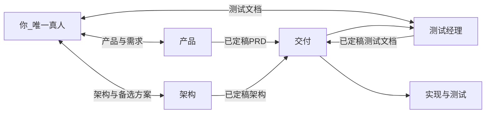
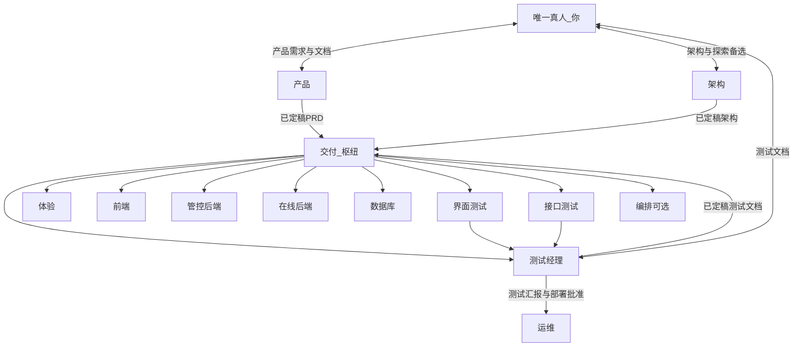
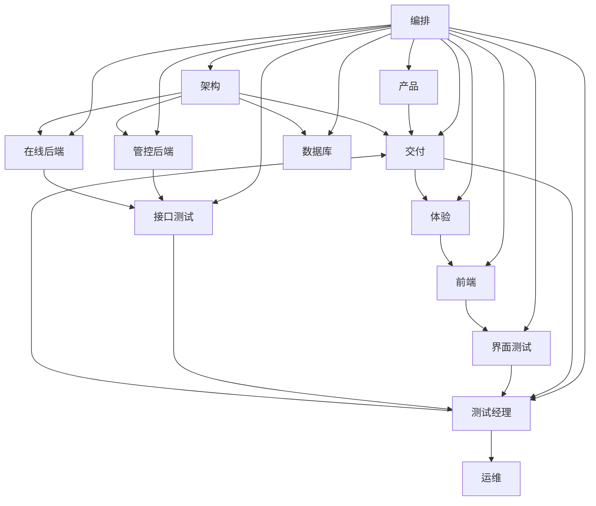

# 自动化角色体系

> 流程图为 **Mermaid** 源码（在支持 Mermaid 的编辑器或 GitHub 中可渲染），**不附**独立图片文件。
>
> **列表体例**：表格内并列项用 HTML `<ul><li>`（实心项目符号一致）；表格外长段落中的并列项亦统一为 `<ul>`。条内再分点用行内 `•` 或拆成多条 `<li>`，**不**使用 Markdown 嵌套列表（避免二级空心圆点与一级实心混排）。
>
> **快速导航：** [导语](#intro) · [读前须知](#read-first) · [角色注册表](#registry) · [协作原则](#principles) · [唯一真人模式](#human-mode) · [编排完整图](#orchestration-full) · [产品成熟度](#maturity) · [纯自动化链](#autochain) · [角色定义卡](#role-cards) · [落地建议](#execution) · [附录](#appendix)

## 导语与模板边界

**本文档为通用模板**（不绑定具体仓库路径、技术栈或领域名词）。落地到某一项目时，请**另写**一份 **项目级补充文档**（例如 `docs/agent-project-<项目名>.md`），结合本模板与**该仓库**的目录、API、CI、环境等做映射；**本文件不随单项目细节改版**。

本文档描述可落地的 **自动化角色** 协作方式，要点如下：

<ul>
<li><strong>唯一真人是你</strong></li>
<li><strong>测试驱动</strong>：<strong>已定稿测试文档</strong>（你批准）→ 再开发；实现侧尽量 <strong>TDD</strong></li>
<li><strong>专业对接</strong>：<strong>产品</strong>（产品文档）、<strong>架构</strong>（架构文档，双向）、<strong>测试经理</strong>（测试文档 + 测试汇报与部署裁决）</li>
<li><strong>交付</strong>：在 <strong>PRD + 架构 + 测试文档</strong> 齐备后串联执行，<strong>不</strong>代你与 <strong>架构</strong> 共创</li>
<li><strong>责任边界</strong>：<strong>你不对交付</strong> 的过程性产出负责（可抽查）</li>
</ul>

拓扑与细则见下文。

## 读前须知

### 称呼说明（正文不带「Agent」）

正文统一用下表**角色称呼**，**不**再写「某某 Agent」。

<ul>
<li>需要英文称谓、规则文件名或代码常量时 → <strong>附录 · <a href="#bilingual">对外用语与代号</a></strong></li>
<li>仅查代号时 → <strong>附录 · <a href="#english-codes">英文代号</a></strong></li>
</ul>

### 角色分类与一句话速览

#### 角色分类

| **类别** | **侧重** | **包含角色** |
|:---:|:---|:---|
| **管理** | <ul><li>范围与决策</li><li>文档与门禁</li><li>执行串联</li></ul> | <ul><li><strong>产品</strong>、<strong>交付</strong>、<strong>架构</strong></li></ul> |
| **开发** | <ul><li>设计稿与前后端实现</li><li>数据与迁移</li></ul> | <ul><li><strong>界面设计</strong>、<strong>前端</strong>、<strong>管控后端</strong>、<strong>在线后端</strong>、<strong>数据库</strong></li></ul> |
| **测试** | <ul><li>测试文档</li><li>用例执行、向测试经理汇报</li></ul> | <ul><li><strong>测试经理</strong>、<strong>界面测试</strong>、<strong>接口测试</strong></li></ul> |
| **维护** | <ul><li>部署、流水线、环境</li><li>可选从交付拆出</li></ul> | <ul><li><strong>运维</strong>、<strong>编排</strong>（可选）</li></ul> |

体验/交互可在团队中由专人或 **前端** 兼管，本模板不单独占一行角色。

#### 一句话速览

| **通俗称呼** | **做什么（一句话）** |
|:---:|:---|
| **产品** | <ul><li>写 PRD / 需求与验收口径，<strong>不</strong>写代码</li></ul> |
| **交付** | <ul><li>串联各角色、排期分派</li><li><strong>不</strong>替你与 <strong>架构</strong> 共创架构</li></ul> |
| **架构** | <ul><li>出架构文档与技术边界</li><li>与你 <strong>双向</strong> 对齐</li></ul> |
| **测试经理** | <ul><li>写版本化测试文档、收汇报</li><li><strong>批准</strong> 后 <strong>运维</strong> 才能部署</li></ul> |
| **运维** | <ul><li>CI/CD 与部署执行</li><li><strong>仅</strong>在 <strong>测试经理</strong> 批准之后动环境</li></ul> |
| **界面设计** | <ul><li>出界面规格/设计稿，<strong>不</strong>直接改业务仓库（除非约定路径）</li></ul> |
| **前端** | <ul><li>实现界面与联调</li></ul> |
| **管控后端** | <ul><li>管理/控制面后端（与「在线后端」相对，具体含义以架构为准）</li></ul> |
| **在线后端** | <ul><li>在线/执行路径上的后端</li></ul> |
| **数据库** | <ul><li>迁移、库表结构、数据策略</li></ul> |
| **界面测试** | <ul><li>跑界面侧测试并汇报 <strong>测试经理</strong></li></ul> |
| **接口测试** | <ul><li>跑 API 契约测试并汇报 <strong>测试经理</strong></li></ul> |
| **编排**（可选） | <ul><li>从 <strong>交付</strong> 拆出的子能力，<strong>默认</strong>并入 <strong>交付</strong></li></ul> |

**禁用**：用含糊的「PM」指代人；须说 **产品** 或 **交付**。

下文 **角色注册表** 为输入/输出/禁止项速查（表内约定仍为**草稿**级，可按项目收紧）。

**角色定义卡** 按管理 / 开发 / 测试 / 维护 展开，与上表类别一致。

---

## 角色注册表（速查）

下表列较多，窄屏可横向滚动；首列已用 **居中** 突出角色名。

| **称呼** | **类别** | **核心输入** | **核心输出** | **禁止项（示例）** |
|:---:|:---|:---|:---|:---|
| **产品** | 管理 | <ul><li>你的需求要点、优先级、范围</li></ul> | <ul><li>版本化 PRD、用户故事、验收标准</li></ul> | <ul><li>不写实现代码</li><li>不替代 **架构**</li><li>不指挥 **交付** 以外的 **执行角色**</li></ul> |
| **交付** | 管理 | <ul><li>**已定稿** PRD + 架构 + 测试文档</li><li>CI/仓库状态</li></ul> | <ul><li>任务看板、执行侧完成定义核对、发布摘要对接</li></ul> | <ul><li>不参与你与 **架构** 的架构共创</li><li>测试文档未批准不向实现类分派开发</li><li>密钥明文不入库</li></ul> |
| **架构** | 管理 | <ul><li>技术偏好/红线</li><li>已定稿 PRD（抄送）</li><li>仓库 README/OpenAPI</li></ul> | <ul><li>版本化架构文档</li><li>可选主方案 + 探索备选附录</li></ul> | <ul><li>不直接改生产配置</li><li>未定稿前不作为执行唯一依据</li></ul> |
| **测试经理** | 测试 | <ul><li>已定稿 PRD + 架构</li><li>迭代范围</li><li>界面/接口测试汇报</li></ul> | <ul><li>版本化测试文档</li><li>**部署前放行**</li></ul> | <ul><li>你批准前不推动开发启动</li><li>不写业务实现代码</li><li>无有效汇报与放行不指示 **运维** 部署</li></ul> |
| **界面设计** | 开发 | <ul><li>**交付** 下发的 PRD 摘要</li><li>**已定稿测试文档** 中的界面验收点</li></ul> | <ul><li>设计说明/设计稿导出</li></ul> | <ul><li>不直接改业务仓库代码（除非约定为设计导出路径）</li></ul> |
| **前端** | 开发 | <ul><li>设计稿</li><li>PRD</li><li>**已定稿测试文档**</li><li>API 约定</li></ul> | <ul><li>前端/静态资源变更</li></ul> | <ul><li>不伪造后端契约</li></ul> |
| **管控后端** | 开发 | <ul><li>架构文档</li><li>**已定稿测试文档**</li><li>领域与 OpenAPI</li></ul> | <ul><li>管控面 API 与测试</li></ul> | <ul><li>不绕过统一错误码与契约</li></ul> |
| **在线后端** | 开发 | <ul><li>架构文档</li><li>**已定稿测试文档**</li><li>与管控面约定</li></ul> | <ul><li>在线请求链与观测建议</li></ul> | <ul><li>热路径不阻塞式依赖管控面</li></ul> |
| **数据库** | 开发 | <ul><li>架构与迁移需求</li></ul> | <ul><li>迁移规范与评审意见</li></ul> | <ul><li>无备份环境不执行破坏性变更</li></ul> |
| **界面测试** | 测试 | <ul><li>**已定稿测试文档**</li><li>PRD</li><li>构建</li><li>**交付** 协调的范围</li></ul> | <ul><li>界面测试报告与可选自动化</li></ul> | <ul><li>不改业务代码</li><li>不替代测试经理主文档</li><li>**向测试经理汇报**</li><li>不直接触发 **运维**</li></ul> |
| **接口测试** | 测试 | <ul><li>**已定稿测试文档**</li><li>OpenAPI</li><li>错误码表</li><li>环境 URL</li></ul> | <ul><li>接口测试报告与自动化证据</li></ul> | <ul><li>不依赖未文档化私有行为</li><li>不替代测试经理主文档</li><li>**向测试经理汇报**</li><li>不直接触发 **运维**</li></ul> |
| **运维** | 维护 | <ul><li>架构部署视图</li><li>CI 产物</li><li>**测试经理** 部署批准</li></ul> | <ul><li>部署执行</li><li>发布摘要</li></ul> | <ul><li>**无测试经理批准不部署任何环境**</li><li>不将密钥写入仓库</li></ul> |
| **编排**（可选） | 维护 | <ul><li>已进入 **交付** 的三路定稿、分派状态</li></ul> | <ul><li>内部看板与核对清单草案</li></ul> | <ul><li>不对你输出</li><li>不替代密钥与对外承诺</li></ul> |

> **说明**：入口提示词路径、默认输出目录可在仓库 `docs/` 或 `.cursor/rules/` 中按项目再填。

---

## 协作原则与门禁

### 测试驱动与测试文档门禁（总策略）

| **层级** | **含义** |
|:---:|:---|
| **流程层** | <ul><li>**PRD + 架构** 均已定稿</li><li>**测试经理** 编写 **版本化测试文档**</li><li>**你** 批准</li><li>**交付** 才可分派 **实现类** 任务（体验/交互、前端、后端、数据库等）</li></ul> |
| **实现层** | <ul><li>**开发角色** 在迭代内尽量遵循 **TDD**</li><li>先 **自动化测试**（单元/集成/契约，以仓库约定为准），再实现至通过（红 → 绿 → 重构）</li></ul> |
| **界面/接口测试分工** | <ul><li>**测试经理**：定「测什么、验收如何写成可执行条目」</li><li>**界面测试 / 接口测试**：在 **有可运行构建后** 负责 **执行、自动化、报告**，对齐已定稿测试文档</li></ul> |
| **部署与测试汇报链** | <ul><li>链路：**界面测试 / 接口测试** → **测试经理** → **批准** → **运维**</li><li>**禁止** 界面/接口测试或 **架构** 直连触发 **运维** 部署</li></ul> |

下文「编排与数据流（完整图）」中的部署关系与本表 **部署与测试汇报链** 一致，仅补充角色节点。

---

## 唯一真人模式：你的位置与分工

**你的画像**：

- 体系中 **唯一真人**
- 希望 **产品方向** 与 **技术架构** 都符合自己的判断——包括对熟悉栈的坚持，也愿意评估 **架构** 提出的新方案
- 目标将当前产品做成可对外展示的 **成型交付**，节奏由你自定

### 你直接对接的专业线：产品经理 + 架构师 + 测试经理

| **接口** | **你做什么** | **谁承接** |
|:---:|:---|:---|
| **↔ 产品** | <ul><li>**输入**：需求要点、迭代目标、约束、优先级</li><li>**验收**：**产品文档**（PRD、用户故事、验收标准等），定稿后作为需求基线</li></ul> | <ul><li>**产品**</li><li>定稿后抄送 **交付**</li></ul> |
| **↔ 架构** | <ul><li>**输入**：技术红线、**你熟悉并希望沿用的架构/模式**、非功能约束、可探索边界</li><li>**对话**：审阅主方案与 **备选/探索方案**</li><li>**验收**：**架构文档**</li></ul> | <ul><li>**架构**</li><li>定稿后抄送 **交付**</li><li>**交付 不替你与架构对话**</li></ul> |
| **↔ 测试经理** | <ul><li>**输入**：已定稿 **PRD** 与 **架构文档**（**交付** 协调范围与版本）</li><li>**验收**：**测试文档**（计划、矩阵、追溯）</li><li>**通过后**才允许 **实现开发**</li></ul> | <ul><li>**测试经理**</li><li>定稿后交 **交付** 作为契约</li></ul> |

### 交付（执行枢纽：「产品 + 架构」定稿后先测后写）

<ul>
<li><strong>输入与门禁</strong> • 起点：<strong>两路已定稿</strong>——<strong>产品</strong> 的 PRD（你已批准）、<strong>架构</strong> 的架构文档（你已批准） • 协调 <strong>测试经理</strong> 产出 <strong>测试文档</strong>；<strong>第三路门禁</strong> 为 <strong>你</strong> 对测试文档的批准 • <strong>三路齐备且测试文档已批准</strong> 后，才对 <strong>体验/交互、前端、后端、数据库</strong> 分派开发任务，并对 <strong>界面/接口测试执行、运维、交付编排</strong> 做分派与跟进</li>
<li><strong>与架构 / 测试的边界</strong> • <strong>不</strong>要求 <strong>交付</strong>「组织架构出稿」——那是 <strong>你 ↔ 架构</strong> 的职责 • <strong>不</strong>代替 <strong>你</strong> 验收测试文档（<strong>测试经理</strong> 对你接口）</li>
<li><strong>变更与指令</strong> • <strong>你</strong>不逐一向 <strong>实现类角色</strong> 下指令 • 需求变更走 <strong>产品</strong>；架构变更走 <strong>架构</strong>；二者定稿后再由 <strong>交付</strong> 调整执行计划 • <strong>测试文档</strong> 须随变更 <strong>回写或升版</strong> 并经 <strong>你</strong> 批准，再进入实现</li>
<li><strong>过程性交付物</strong>：<strong>你不对交付</strong> 的过程性交付物（看板、日报、执行侧完成定义）负责验收；需要时可抽查。</li>
<li><strong>部署与密钥</strong> • <strong>对外承诺</strong> 与 <strong>生产密钥的保管方式</strong> 仍由 <strong>你</strong> 决策 • <strong>部署/发版</strong> 由 <strong>运维</strong> 执行，但 <strong>仅</strong>在 <strong>CI/约定测试通过</strong> 且 <strong>测试经理</strong> 已 <strong>批准</strong>（基于 <strong>界面测试 / 接口测试</strong> 的测试汇报）后，才对 <strong>任意目标环境</strong> 触发 • <strong>你</strong> 以 <strong>测试结论与发布摘要</strong> <strong>知情</strong> 即可，无需每版手动点发布</li>
</ul>

### 关系简图（三线接口 + 交付枢纽）

只保留 **你**、**产品**、**架构**、**测试经理**、**交付** 与汇总节点 **实现与测试**，用于快速理解「谁对接你、谁汇到交付」。需要看体验/前端/后端/测试执行/运维等**全角色**时，见下一节完整图。

## 编排与数据流（完整图）

在「关系简图」基础上展开 **体验、前端、双后端、数据库、界面/接口测试、运维、编排**，并画出测试汇报与部署批准边。与 **协作原则与门禁** 中的 **部署与测试汇报链** 一致。

<blockquote>
<ul>
<li><strong>原则</strong></li>
<li><strong>你</strong>对接 <strong>产品</strong>、<strong>架构</strong> 与 <strong>测试经理</strong>（测试文档门禁 + <strong>测试执行汇报与部署批准</strong>）</li>
<li><strong>交付</strong> 在 <strong>PRD + 架构</strong> 定稿后串联 <strong>测试文档</strong>，<strong>测试文档经你批准后</strong> 才管理实现与测试执行；<strong>不</strong>替代你与 <strong>架构</strong> 的对话</li>
<li><strong>界面测试 / 接口测试</strong> → <strong>测试经理</strong>；批准后 <strong>运维</strong> 才对 <strong>各环境</strong> 部署</li>
<li>密钥不进明文仓库，<strong>你</strong> 配置流水线密钥或等价方式</li>
</ul>
</blockquote>

## 产品成熟度：P0 / P1 / P2

从雏形走向可对外演示的通用里程碑（与「三线接口」正交：接口不变，阶段目标递增）。

| **阶段** | **目标** | **典型产出** | **你重点投入** |
|:---:|:---|:---|:---|
| **P0 雏形加固** | <ul><li>当前仓库可稳定演示：管理 API + 已有 UI 可用</li><li>文档与环境可复现</li></ul> | <ul><li>README/环境说明</li><li>最小自动化测试</li><li>静态 UI 与 API 对齐</li></ul> | <ul><li>全栈打通</li><li>定规范</li></ul> |
| **P1 成型 MVP** | <ul><li>明确管控面与在线面边界</li><li>各有一条主路径端到端可用</li></ul> | <ul><li>架构一页纸</li><li>核心 API 与错误码稳定</li><li>基础可观测</li></ul> | <ul><li>架构决策</li><li>关键代码</li></ul> |
| **P2 可演示可交付** | <ul><li>对外讲故事：安全/备份/发布流程有说法</li><li>演示脚本可重复</li></ul> | <ul><li>发布核对清单</li><li>测试报告</li><li>产品一页纸</li></ul> | <ul><li>管理节奏</li><li>质量门禁</li></ul> |

## 纯自动化链（对照）

无真人、全自动化时的中枢与依赖关系，用于与「唯一真人」模式对照。要点：

<ul>
<li><strong>部署授权</strong>：<strong>仅</strong> <strong>测试经理 → 运维</strong>（架构对运维的<strong>部署视图</strong>经制品/配置进入流水线，<strong>不</strong>视为授权边）</li>
<li><strong>对照</strong>：<strong>唯一真人</strong>模式以 <strong>三线接口 + 测试门禁 + 交付枢纽</strong> 为准</li>
</ul>

---

## 角色定义卡（按分类）

以下每张卡可直接迁移为 **Cursor 规则 / Skill / 系统提示词** 的骨架。**默认**：**你** 直连 **产品 / 架构 / 测试经理**；**交付** 分派实现与测试；**运维** 仅接 **测试经理** 的部署批准；**交付** 不代你与 **架构** 做架构共创。

**体例**：下表「说明」列中，并列要点一律用 HTML `<ul><li>` 列出（含仅一条时），便于与「角色注册表」等处列表样式一致；子项层级不在表内再嵌套 `<ul>`，避免项目符号空心/实心混排。

### 管理

#### 产品

| **维度** | **说明** |
|:---:|:---|
| **目的** | <ul><li><strong>产品侧</strong>：接收 <strong>你</strong> 的需求描述，交付 <strong>产品文档</strong> 供你验收</li><li><strong>不</strong>串联实现链；<strong>不</strong>替代 <strong>架构</strong></li></ul> |
| **典型输入** | <ul><li><strong>仅来自你</strong> 的口述要点、备忘录、迭代目标、范围变更</li></ul> |
| **典型输出** | <ul><li>PRD、用户故事、验收标准、变更摘要</li><li><strong>已定稿版本</strong> 交给 <strong>交付</strong> 作为交付契约输入</li></ul> |
| **工具** | <ul><li>文档仓库（Markdown）</li><li>可选 issue 模板</li></ul> |
| **约束** | <ul><li>不写实现代码</li><li>不擅自扩大范围（须经 <strong>你</strong> 确认）</li><li><strong>不</strong>替代 <strong>交付</strong> 做排期与分派</li><li><strong>不</strong>验收架构文档</li></ul> |
| **交接** | <ul><li>经你批准的产品文档 → <strong>交付</strong>（执行输入之一）</li><li><strong>架构</strong> 由你直接对接，<strong>不</strong>经 <strong>交付</strong> 指派出稿</li></ul> |

#### 交付

| **维度** | **说明** |
|:---:|:---|
| **目的** | <ul><li><strong>执行与项目侧</strong>：在 <strong>PRD + 架构</strong> 已定稿后，协调 <strong>测试经理</strong> 产出测试文档；在 <strong>测试文档</strong> 经 <strong>你</strong> 批准后，对 <strong>体验/交互、前端、后端、数据库、测试执行、运维、交付编排</strong> 负 <strong>串联责任</strong>（可内嵌原 <strong>编排</strong>）</li><li><strong>你不对本角色负责</strong>（不验收其过程性产出，除非你主动抽查）</li></ul> |
| **典型输入** | <ul><li><strong>两路定稿</strong>：<strong>产品</strong> 的 PRD；<strong>架构</strong> 的架构文档</li><li><strong>测试文档定稿</strong>：<strong>测试经理</strong> 的测试文档（均已由你批准）</li><li>仓库与 CI；各 <strong>执行角色</strong> 回传</li></ul> |
| **典型输出** | <ul><li>任务看板、对内里程碑、执行侧完成定义核对、发布摘要对接</li><li>若执行与 PRD/架构/测试文档冲突，<strong>分别</strong>升回 <strong>产品</strong>、<strong>架构</strong> 或 <strong>测试经理</strong> 路径，<strong>不</strong>替代你做架构或产品决策</li></ul> |
| **工具** | <ul><li>Issue/Milestone、Markdown 看板</li><li>与 CI 联动</li></ul> |
| **约束** | <ul><li>不写实现代码</li><li><strong>在测试文档批准前</strong> 不向 <strong>实现类角色</strong>（体验/交互、前端、管控后端、在线后端、数据库）分派开发任务</li><li><strong>不</strong>替代 <strong>你</strong> 验收测试文档</li><li><strong>不</strong>替代 <strong>你 ↔ 架构</strong> 的架构共创</li></ul> |
| **交接** | <ul><li>协调 <strong>测试经理</strong>；测试文档批准后，对实现与测试执行分派与跟进</li><li><strong>不向架构下达创意任务</strong>（<strong>架构</strong> 由你直连）</li></ul> |

#### 架构

| **维度** | **说明** |
|:---:|:---|
| **目的** | <ul><li>划分 <strong>管控面与在线面</strong> 边界、接口与数据流</li><li>在 <strong>你</strong> 给出的技术偏好与红线内出 <strong>主方案</strong>，并 <strong>可提出探索性/非常规备选</strong>（新组件、新模式、风险与回滚点），供你取舍</li><li>最终 <strong>架构文档</strong> 由你验收后交 <strong>交付</strong> 驱动落地</li></ul> |
| **典型输入** | <ul><li><strong>你</strong> 直接提供的：熟悉栈、模式偏好、禁止项、可探索范围</li><li><strong>经你批准的产品文档</strong>（由 <strong>产品</strong> 定稿，可抄送 <strong>架构</strong>）</li><li>现有仓库 README/OpenAPI、非功能需求</li></ul> |
| **典型输出** | <ul><li>架构文档（上下文图/组件图/关键序列）、API 契约说明、与 DB 迁移策略原则</li><li><strong>可选「方案 B/C」</strong> 附录（探索项）</li></ul> |
| **工具** | <ul><li>Mermaid/PlantUML、OpenAPI 引用、<code>README.md</code> 对齐</li></ul> |
| **约束** | <ul><li>不直接提交生产配置</li><li>与 <strong>数据库</strong> 的落地协作由 <strong>交付</strong> 在 <strong>架构定稿后</strong> 组织</li><li><strong>你</strong> 验收通过前不视为最终基线</li></ul> |
| **交接** | <ul><li>架构文档 → <strong>你验收</strong>；通过后由 <strong>交付</strong> 同步给 <strong>测试经理</strong>（编写测试文档）及后续 <strong>管控后端 / 在线后端 / 数据库</strong> 等</li><li><strong>交付 不参与你与架构的架构对话</strong></li></ul> |

### 开发

#### 界面设计

| **维度** | **说明** |
|:---:|:---|
| **目的** | <ul><li>在编码前输出可交付的界面规格，减少 UI 开发返工</li></ul> |
| **典型输入** | <ul><li><strong>仅</strong>在 <strong>测试文档</strong> 经 <strong>你</strong> 批准后，由 <strong>交付</strong> 下发的 PRD 摘要</li><li><strong>已定稿测试文档</strong> 中与 UI 相关的 <strong>验收点</strong></li><li>品牌/组件约束、目标平台（Web/移动端）</li></ul> |
| **典型输出** | <ul><li>设计稿链接或导出说明、页面清单、组件与状态（空/错/加载）、交互备注 Markdown</li></ul> |
| **工具** | <ul><li>团队选定的设计工具（含 AI 辅助设计、Figma 等）</li><li>截图/标注导出</li></ul> |
| **约束** | <ul><li>不直接改仓库代码</li><li>复杂交互需标注「需架构/界面开发确认」</li><li>输出必须可被 <strong>前端</strong> 映射到页面路由与组件树</li></ul> |
| **交接** | <ul><li>对 <strong>交付</strong> 汇报</li><li>由 <strong>交付</strong> 与前端开发、<strong>架构</strong> 对齐</li></ul> |

#### 前端

| **维度** | **说明** |
|:---:|:---|
| **目的** | <ul><li>将设计与 PRD 落实为可联调的前端代码</li><li>遵循 <strong>TDD</strong> 时对 <strong>可测行为</strong> 先补测试（如前端单元/E2E 约定）再实现</li></ul> |
| **典型输入** | <ul><li>UI 设计产出</li><li>PRD</li><li><strong>已定稿测试文档</strong></li><li>OpenAPI 或后端约定基址</li></ul> |
| **典型输出** | <ul><li>静态资源或前端工程变更、联调说明、环境变量示例</li></ul> |
| **工具** | <ul><li>项目约定的前端目录或独立前端工程、浏览器、HTTP 客户端（以架构为准）</li></ul> |
| **约束** | <ul><li>不伪造后端契约</li><li>错误与空态与 <strong>已定稿 PRD</strong> 与 <strong>测试文档</strong> 一致</li><li>大文件/密钥不进库</li></ul> |
| **交接** | <ul><li>可测构建说明 → <strong>界面测试</strong>（由 <strong>交付</strong> 协调）</li></ul> |

#### 管控后端（管理/控制面）

| **维度** | **说明** |
|:---:|:---|
| **目的** | <ul><li>实现架构中 <strong>管理（控制）面</strong> 的后端能力（具体领域由 PRD/架构定义）</li></ul> |
| **典型输入** | <ul><li>架构文档</li><li><strong>已定稿测试文档</strong>（<strong>测试经理</strong>）</li><li>领域模型、API 契约、数据库迁移约定（若有）</li></ul> |
| **典型输出** | <ul><li>后端模块变更、自动化测试、行为说明片段</li></ul> |
| **工具** | <ul><li>项目构建与测试栈、团队约定的分层/包结构（以架构为准）</li></ul> |
| **约束** | <ul><li>不绕过统一异常与错误语义</li><li>变更契约须通知 <strong>接口测试</strong></li><li>新增/变更行为优先 <strong>TDD</strong>（与 <strong>已定稿测试文档</strong> 对齐）</li></ul> |

#### 在线后端（在线/执行面）

| **维度** | **说明** |
|:---:|:---|
| **目的** | <ul><li>实现架构中 <strong>在线（执行）面</strong> 的请求处理链（具体形态由架构定义）</li></ul> |
| **典型输入** | <ul><li>架构文档</li><li><strong>已定稿测试文档</strong></li><li>与控制面/配置读的约定、SLO（若有）</li></ul> |
| **典型输出** | <ul><li>在线路径代码、运行时说明、观测点（日志/指标）建议</li></ul> |
| **工具** | <ul><li>同技术栈与流水线</li><li>压测脚本可选</li></ul> |
| **约束** | <ul><li>与控制面解耦</li><li>避免在热路径引入阻塞式管理面调用（按架构约束）</li><li>新增/变更行为优先 <strong>TDD</strong></li></ul> |

#### 数据库（数据/迁移）

| **维度** | **说明** |
|:---:|:---|
| **目的** | <ul><li>保证库表结构可演进、可回滚，权限与备份策略清晰</li></ul> |
| **典型输入** | <ul><li>架构师数据模型</li><li>后端迁移需求</li><li>审计/历史字段要求（若适用）</li></ul> |
| **典型输出** | <ul><li>迁移脚本规范、评审意见、环境初始化核对清单、索引与慢查询建议</li></ul> |
| **工具** | <ul><li>Flyway/Liquibase 或项目既定迁移方式、DB 文档</li></ul> |
| **约束** | <ul><li>不直接在无备份环境执行破坏性变更</li><li>生产变更窗口由 <strong>你</strong> 批准（<strong>交付</strong> 可起草核对清单）</li></ul> |

### 测试

#### 测试经理

| **维度** | **说明** |
|:---:|:---|
| **目的** | <ul><li><strong>测试经理侧</strong>：在 <strong>PRD</strong> 与 <strong>架构文档</strong> 已定稿的前提下，产出 <strong>版本化测试文档</strong>，作为 <strong>开发启动门禁</strong></li><li>与 <strong>你</strong> 对齐「测什么、如何验收」</li><li><strong>接收</strong> <strong>界面测试 / 接口测试</strong> 的 <strong>测试执行汇报</strong>，并对 <strong>各环境部署</strong> 作出 <strong>批准/不批准</strong></li><li><strong>不</strong>替代 <strong>产品</strong> 写需求，<strong>不</strong>替代 <strong>界面测试 / 接口测试</strong> 的 <strong>执行与回归自动化</strong>（二者分工见上文）</li></ul> |
| **典型输入** | <ul><li>已定稿 PRD、已定稿架构文档</li><li>迭代范围与版本号（由 <strong>交付</strong> 协调）</li><li>可选 OpenAPI/领域名词表</li><li><strong>来自界面测试 / 接口测试 的测试报告与缺陷结论</strong>（部署前）</li></ul> |
| **典型输出** | <ul><li><strong>测试计划</strong>、<strong>用例/场景矩阵</strong>（含负面与边界）、<strong>与 PRD 条目的追溯</strong>（需求 ID ↔ 用例）、<strong>环境/数据前置说明</strong></li><li>变更时升版并附变更摘要</li><li><strong>部署前放行结论</strong>（对目标环境是否允许 <strong>运维</strong> 部署）</li></ul> |
| **工具** | <ul><li>Markdown/表格、可选测试管理类工具</li><li>与 issue 模板对齐</li></ul> |
| **约束** | <ul><li><strong>在测试文档经你批准前</strong>，不宣称「可开始开发」</li><li>不写业务实现代码</li><li>用例应 <strong>可被</strong> 界面测试 / 接口测试 <strong>落地为可执行脚本</strong>（或明确标注仅手工）</li><li><strong>无</strong>有效测试汇报与放行结论时，<strong>不</strong>指示 <strong>运维</strong> 部署 <strong>任何环境</strong></li></ul> |
| **交接** | <ul><li>测试文档 → <strong>你验收</strong> → <strong>交付</strong> 分派开发</li><li><strong>界面测试 / 接口测试</strong> 按基线执行并 <strong>向测试经理汇报</strong></li><li><strong>部署批准</strong> → <strong>运维</strong>（全环境）</li></ul> |

#### 界面测试

| **维度** | **说明** |
|:---:|:---|
| **目的** | <ul><li>从用户与界面视角 <strong>执行</strong> 验证并形成 <strong>测试报告</strong></li><li>与 <strong>测试经理</strong> 的 <strong>已定稿测试文档</strong> 对齐并补充 <strong>可执行自动化</strong>（Playwright/Cypress 等）</li></ul> |
| **典型输入** | <ul><li><strong>已定稿测试文档</strong>（<strong>测试经理</strong>）</li><li>PRD、设计说明、可访问的 UI 构建</li><li>版本/范围由 <strong>交付</strong> 协调</li></ul> |
| **典型输出** | <ul><li>用例执行记录、缺陷列表、测试报告（Markdown/HTML/PDF 等约定）</li><li>可选自动化脚本</li></ul> |
| **工具** | <ul><li>手工探索</li><li>可选 Playwright/Cypress（若引入需与流水线一致）</li></ul> |
| **约束** | <ul><li>接口层问题转交 接口测试</li><li>不修改业务代码（仅报告）</li><li><strong>测试计划/用例的「主文档」以测试经理产出为准</strong>，<strong>界面测试</strong> 不重复定义范围</li><li><strong>不</strong>直接驱动 <strong>运维</strong> 部署</li></ul> |
| **交接** | <ul><li>→ <strong>测试经理</strong>（汇报）</li><li>部署须 <strong>测试经理</strong> 批准后由 <strong>运维</strong> 执行（见 <strong>测试经理</strong>、<strong>运维</strong> 两节）</li></ul> |

#### 接口测试

| **维度** | **说明** |
|:---:|:---|
| **目的** | <ul><li>从契约与接口视角 <strong>执行</strong> 验证并产出 <strong>自动化证据与测试报告</strong></li><li>与 <strong>已定稿测试文档</strong> 对齐</li></ul> |
| **典型输入** | <ul><li><strong>已定稿测试文档</strong>（<strong>测试经理</strong>）</li><li>OpenAPI 或等价 API 契约、错误码表、测试环境 URL</li></ul> |
| **典型输出** | <ul><li>用例与测试数据、接口自动化脚本、测试报告、CI 附件</li></ul> |
| **工具** | <ul><li>HTTP 客户端、契约/集合测试工具、项目选用的测试框架、CI 报告附件</li></ul> |
| **约束** | <ul><li>不依赖未文档化的私有行为</li><li>与 <strong>界面测试</strong> 划分：契约失败归接口层，纯展示问题归界面层</li><li><strong>测试范围以测试经理为准</strong></li><li><strong>不</strong>直接驱动 <strong>运维</strong> 部署</li></ul> |
| **交接** | <ul><li>同 <strong>界面测试</strong>（→ <strong>测试经理</strong> → <strong>运维</strong>）</li></ul> |

### 维护

#### 运维

| **维度** | **说明** |
|:---:|:---|
| **目的** | <ul><li><strong>部署与运维自动化</strong>（CI/CD、制品部署到目标环境、回滚与健康检查脚本等）</li><li><strong>仅</strong>在 <strong>CI/约定测试通过</strong> 且 <strong>测试经理</strong> 已基于 <strong>界面测试 / 接口测试</strong> 汇报作出 <strong>部署批准</strong> 后，对 <strong>目标环境</strong> 执行部署</li><li>向 <strong>你</strong> 提供 <strong>发布摘要</strong>（版本、环境、时间、健康检查结果）</li></ul> |
| **典型输入** | <ul><li><strong>已定稿架构文档</strong> 中的部署与运维视图</li><li>制品版本、CI 产物、环境矩阵</li><li><strong>测试经理</strong> 的 <strong>部署批准</strong>（与测试汇报结论绑定）</li></ul> |
| **典型输出** | <ul><li>CI/CD 定义（pipeline 即代码）、部署说明、回滚步骤、执行日志摘要</li></ul> |
| **工具** | <ul><li>按架构选型：CI 平台、容器、编排、SSH 等</li><li>密钥通过流水线密钥或等价方式注入，<strong>不进明文仓库</strong></li></ul> |
| **约束** | <ul><li><strong>无测试经理对测试汇报的部署批准</strong>，<strong>不</strong>对 <strong>任何环境</strong> 执行部署</li><li><strong>不跳过</strong> CI/既定测试门禁</li><li><strong>不</strong>将密钥写入仓库</li><li>失败时具备可执行回滚路径（由架构文档与运维约定一致）</li></ul> |

#### 编排（可选）

| **维度** | **说明** |
|:---:|:---|
| **目的** | <ul><li><strong>可选</strong>：当 <strong>交付</strong> 过重时，拆出 <strong>交付编排</strong> 子能力</li><li><strong>默认</strong>建议并入 <strong>交付</strong></li><li><strong>不对你输出</strong>；你的专业入口仍是 <strong>产品 + 架构 + 测试经理</strong></li></ul> |
| **典型输入** | <ul><li>经你批准的产品文档、架构文档与测试文档（均已进入 <strong>交付</strong>）</li><li><strong>交付</strong> 内部分派状态、仓库与 CI 状态</li></ul> |
| **典型输出** | <ul><li>内部看板与核对清单草案，供 <strong>交付</strong> 汇总</li></ul> |
| **工具** | <ul><li>Issue/Milestone、或纯 Markdown 看板</li><li>与 CI 状态联动（可选）</li></ul> |
| **约束** | <ul><li>不替代 <strong>你</strong> 配置密钥与对外承诺</li><li>不直接写生产密钥</li><li><strong>不</strong>作为你的第二入口</li></ul> |

---

## 落地执行建议（已采纳写入）

<blockquote>
<ul>
<li><strong>完成定义（你验收）</strong></li>
<li><strong>你验收</strong>：PRD + 架构文档 + 测试文档</li>
<li><strong>执行侧完成定义</strong>：由 <strong>交付</strong> 对齐</li>
<li><strong>测试分工</strong>：<strong>测试经理</strong> 主文档；<strong>界面测试 / 接口测试</strong> 执行与自动化（与上文定义卡一致）</li>
</ul>
</blockquote>

以下为操作层约定，与 **三线接口 + 执行枢纽** 一致（条内子要点用 `•` 分行，避免嵌套列表符号不一致）。

<ol>
<li><strong>定稿版本化</strong> • <strong>产品</strong> / <strong>架构</strong> / <strong>测试经理</strong> 产出 PRD、架构文档、测试文档时，均带 <strong>版本号 + 日期</strong> • <strong>交付</strong> 排期与分派只引用 <strong>成组的 PRD + 架构 + 测试文档</strong> 版本，避免执行中「口头对齐、文档未更新」</li>
<li><strong>探索项格式</strong>：<strong>架构</strong> 的备选/探索方案（方案 B/C）每条至少含 <strong>风险</strong>、<strong>回滚方式</strong>、<strong>是否影响当期发布</strong>；你再决定是否纳入范围。</li>
<li><strong>PRD 与架构顺序</strong> • 默认 <strong>先 PRD 大方向、再定架构</strong> • 纯技术债/重构可 <strong>仅走架构</strong>（PRD 仅写非功能/约束）；按迭代类型灵活选择，不必僵化</li>
<li><strong>测试文档门禁</strong> • <strong>PRD + 架构</strong> 定稿后由 <strong>测试经理</strong> 出测试文档，<strong>经你</strong> 批准后 <strong>开发</strong> 才启动 • 需求或架构变更影响范围时，<strong>测试文档</strong> 同步升版并重新批准</li>
<li><strong>TDD 执行</strong> • <strong>实现类角色</strong> 对 <strong>新增/变更行为</strong> 优先 <strong>先写失败测试</strong>（或契约）再写实现，<strong>与已定稿测试文档</strong> 对齐 • <strong>CI</strong> 跑自动化 • <strong>部署</strong>（<strong>所有环境</strong>）须 <strong>界面测试 / 接口测试 → 测试经理汇报 → 测试经理批准 → 运维</strong></li>
<li><strong>冲突上升</strong>：执行侧只认 <strong>已冻结的 PRD + 架构 + 测试文档</strong>；新需求或新结构须 <strong>先回写产品、架构 或测试经理 文档</strong>，再进入 <strong>交付</strong>，禁止在执行中「口头改范围」。</li>
<li><strong>真人节奏</strong>：建议每迭代固定 <strong>至少一次产品对齐</strong>（产品）、<strong>至少一次架构对齐</strong>（架构）与 <strong>测试文档评审</strong>（测试经理），降低异步拉扯的认知负担。</li>
</ol>

---

## 附录

### 对外用语与代号

正文以**中文称呼**为准。下表供对外沟通、英文规则或提示词时使用；**代号** 用于文件名与常量（见「英文代号」小节）。

#### 角色称谓与代号

| **中文称呼** | **对外英文参考** | **代号** |
|:---:|:---|:---|
| **产品** | Product | `PM_Product` |
| **交付** | Delivery / Project orchestration | `PM_Project` |
| **架构** | Architecture | `Architect` |
| **测试经理** | Test Manager / QA Lead | `Test_Manager` |
| **界面设计** | UI Design | `UI_Design` |
| **前端** | Frontend | `Frontend` |
| **管控后端** | Backend（控制/管理面） | `Backend_Operation` |
| **在线后端** | Backend（在线/数据面） | `Backend_Online` |
| **数据库** | Database | `Database` |
| **界面测试** | UI Testing | `UI_Test` |
| **接口测试** | API Testing | `API_Test` |
| **运维** | Operations / DevOps | `Ops` |
| **编排**（可选） | Orchestration | `Orchestrator` |

#### 角色类别（中文）

| **类别** |
|:---:|
| **管理** |
| **开发** |
| **测试** |
| **维护** |

#### 常用术语（摘）

| **术语** |
|:---:|
| **唯一真人** |
| **已定稿** |
| **PRD** |
| **架构文档** |
| **测试文档** |
| **门禁** |
| **实现类角色** |
| **执行角色** |
| **交付枢纽** |
| **TDD** |
| **CI/CD** |
| **部署批准** |
| **发布摘要** |

---

### 英文代号（可选，用于规则文件名）

**代号**与上表「角色称谓与代号」中的 **反引号代码** 一致。仅在需要写 **Cursor 规则 / 常量 / 脚本名** 时使用；**正文叙述不必写**。

---

### P0 / P1 / P2 与代码仓库的映射（不在此模板展开）

**本模板只定义阶段目标与角色职责**（见上文「产品成熟度：P0 / P1 / P2」）。

**具体**到某一仓库时，下列内容一律写在 **项目级补充文档** 中，并由 **交付** / **架构** 随演进维护；**勿把单项目路径写回本模板**：

<ul>
<li>目录结构、入口模块</li>
<li>开放 API 文档路径、持续集成命令、配置文件位置等</li>
</ul>

---

### 与上一版文档的关系

<ul>
<li>职责绑定在 <strong>角色卡 + 注册表</strong>；<strong>单仓库路径与类名映射</strong> 已迁出，由 <strong>项目级补充文档</strong> 承载（见上文「P0 / P1 / P2 与代码仓库的映射」）</li>
<li><strong>你</strong> 对接 <strong>产品 / 架构（双向）/ 测试经理</strong>；<strong>交付</strong> 在 <strong>PRD + 架构 + 测试文档</strong> 批准后串联执行</li>
<li><strong>部署链</strong>：界面测试 / 接口测试 → 测试经理 → 运维（<strong>唯一授权边</strong>）</li>
<li>无真人时 <strong>编排</strong> 可作中枢；有真人时 <strong>编排</strong> 并入 <strong>交付</strong>（可选）</li>
<li><strong>禁止</strong>用含糊的「PM」指代人（见 <strong>读前须知 · 称呼说明</strong>）</li>
</ul>
